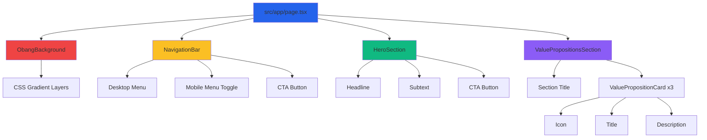

# 구현 계획: 랜딩 페이지 (/)

## 프로젝트 ID: PLAN-PAGE-LANDING

### 제목
365일 사주 서비스 랜딩 페이지 구현

---

## 1. 개요

### 1.1 목표
비로그인 사용자를 위한 첫 진입 페이지를 구현하여, 서비스의 핵심 가치를 전달하고 무료 체험(Google OAuth 로그인)으로 자연스럽게 전환을 유도합니다. 한국 전통 오방색을 현대적으로 재해석한 배경 애니메이션으로 신비감과 기술적 감각을 동시에 전달합니다.

### 1.2 참고 문서
- **요구사항**: `/docs/requirment.md` (섹션 2-①)
- **유저 플로우**: `/docs/userflow.md` (Feature 001, 002)
- **PRD**: `/docs/prd.md`
- **프로젝트 가이드**: `/CLAUDE.md`
- **외부 서비스**: `/docs/external/clerk-integration-guide.md`

### 1.3 범위

**포함 사항**:
- 랜딩 페이지 레이아웃 (`src/app/page.tsx` 리팩토링)
- 오방색 배경 애니메이션 (CSS Gradient 또는 SVG Layer)
- Hero 섹션 (헤드라인, 서브텍스트, CTA 버튼)
- 서비스 가치 제안 카드 3개 (AI 정밀함, 맞춤형 리포트, 간편 구독)
- 내비게이션 바 (홈, 서비스, 복채, FAQ)
- Clerk Google OAuth 연동
- 반응형 디자인 (모바일/태블릿/데스크톱)
- 로그인 상태별 UI 분기 (비로그인: CTA / 로그인: 대시보드 이동)

**제외 사항**:
- FAQ 페이지 세부 내용 (별도 구현)
- 가격 정책 상세 페이지 (UC-009 구독 관리에서 구현)
- 푸터 상세 (이용약관, 개인정보처리방침 등은 별도 구현)

---

## 2. 기술 스택

### 2.1 프론트엔드
- **프레임워크**: Next.js 16 (App Router)
- **UI**: React 19, TailwindCSS 4
- **애니메이션**: CSS Animations + Keyframes
- **아이콘**: Lucide React
- **폰트**: 시스템 폰트 (sans-serif)

### 2.2 인증
- **Clerk SDK**: Google OAuth 로그인
  - `@clerk/nextjs`: 클라이언트 컴포넌트에서 인증 상태 확인
  - `useCurrentUser` 훅 활용

### 2.3 외부 서비스
- **Clerk**: Google OAuth 인증
  - 로그인 URL: `/login` (Clerk 기본 UI)
  - 콜백 후 `/dashboard`로 리다이렉트

---

## 3. 데이터베이스 마이그레이션

### 3.1 새로운 테이블
**없음** - 랜딩 페이지는 정적 콘텐츠만 표시

### 3.2 기존 테이블 수정
**없음**

---

## 4. 구현 단계 (Implementation Steps)

### Phase 1: 오방색 배경 애니메이션 구현

**목표**: 한국 전통 오방색(청·적·황·백·흑)을 CSS Gradient로 구현하여 배경 애니메이션 적용

**작업 항목**:

#### 4.1.1 오방색 색상 상수 정의
- **파일**: `src/styles/colors.ts` (새로 생성)
- **설명**: 오방색 HEX 코드 정의
- **내용**:
  ```typescript
  // 오방색 (Five Traditional Korean Colors)
  export const OBANGSAEK = {
    // 청 (Blue) - 동쪽, 봄, 나무
    blue: '#3B82F6',
    // 적 (Red) - 남쪽, 여름, 불
    red: '#EF4444',
    // 황 (Yellow) - 중앙, 환절기, 흙
    yellow: '#FBBF24',
    // 백 (White) - 서쪽, 가을, 금속
    white: '#F3F4F6',
    // 흑 (Black) - 북쪽, 겨울, 물
    black: '#1F2937',
  } as const;
  ```
- **의존성**: 없음

#### 4.1.2 배경 애니메이션 컴포넌트
- **파일**: `src/features/landing/components/ObangBackground.tsx`
- **설명**: CSS Gradient 기반 배경 애니메이션
- **내용**:
  ```tsx
  'use client';

  export const ObangBackground = () => {
    return (
      <div className="fixed inset-0 -z-10 overflow-hidden">
        {/* Gradient Layer 1 */}
        <div className="absolute inset-0 bg-gradient-to-br from-blue-900 via-purple-900 to-red-900 opacity-40 animate-gradient-shift" />

        {/* Gradient Layer 2 (slower animation) */}
        <div className="absolute inset-0 bg-gradient-to-tl from-yellow-700 via-red-800 to-blue-800 opacity-30 animate-gradient-shift-slow" />

        {/* Overlay for readability */}
        <div className="absolute inset-0 bg-black/40" />
      </div>
    );
  };
  ```
- **CSS 애니메이션** (`src/app/globals.css`에 추가):
  ```css
  @keyframes gradient-shift {
    0%, 100% {
      background-position: 0% 50%;
    }
    50% {
      background-position: 100% 50%;
    }
  }

  @keyframes gradient-shift-slow {
    0%, 100% {
      background-position: 100% 50%;
    }
    50% {
      background-position: 0% 50%;
    }
  }

  .animate-gradient-shift {
    background-size: 200% 200%;
    animation: gradient-shift 10s ease infinite;
  }

  .animate-gradient-shift-slow {
    background-size: 200% 200%;
    animation: gradient-shift-slow 15s ease infinite;
  }
  ```
- **의존성**: 4.1.1

#### 4.1.3 Tailwind Config 확장
- **파일**: `tailwind.config.ts`
- **설명**: 커스텀 애니메이션 및 색상 등록
- **수정 사항**:
  ```typescript
  import type { Config } from 'tailwindcss';

  const config: Config = {
    // 기존 설정...
    theme: {
      extend: {
        colors: {
          obang: {
            blue: '#3B82F6',
            red: '#EF4444',
            yellow: '#FBBF24',
            white: '#F3F4F6',
            black: '#1F2937',
          },
        },
        animation: {
          'gradient-shift': 'gradient-shift 10s ease infinite',
          'gradient-shift-slow': 'gradient-shift-slow 15s ease infinite',
        },
        keyframes: {
          'gradient-shift': {
            '0%, 100%': { backgroundPosition: '0% 50%' },
            '50%': { backgroundPosition: '100% 50%' },
          },
          'gradient-shift-slow': {
            '0%, 100%': { backgroundPosition: '100% 50%' },
            '50%': { backgroundPosition: '0% 50%' },
          },
        },
      },
    },
  };
  export default config;
  ```
- **의존성**: 4.1.1

**Acceptance Tests**:
- [ ] 배경 애니메이션이 10초/15초 주기로 부드럽게 전환
- [ ] 오방색 계열의 그라데이션이 자연스럽게 흐름
- [ ] 오버레이로 텍스트 가독성 확보
- [ ] 모바일에서도 애니메이션 성능 저하 없음

---

### Phase 2: Hero 섹션 구현

**목표**: 헤드라인, 서브텍스트, CTA 버튼을 중앙 배치하여 사용자의 시선 집중

**작업 항목**:

#### 4.2.1 Hero 섹션 컴포넌트
- **파일**: `src/features/landing/components/HeroSection.tsx`
- **설명**: 헤드라인 + 서브텍스트 + CTA 버튼
- **내용**:
  ```tsx
  'use client';

  import Link from 'next/link';

  interface HeroSectionProps {
    isAuthenticated: boolean;
  }

  export const HeroSection = ({ isAuthenticated }: HeroSectionProps) => {
    return (
      <section className="relative flex min-h-[80vh] flex-col items-center justify-center px-6 text-center">
        {/* 헤드라인 */}
        <h1 className="mb-6 text-5xl font-bold tracking-tight text-white md:text-6xl lg:text-7xl">
          당신의 사주, <br className="md:hidden" />
          <span className="bg-gradient-to-r from-yellow-400 via-red-400 to-blue-400 bg-clip-text text-transparent">
            AI가 분석합니다
          </span>
        </h1>

        {/* 서브텍스트 */}
        <p className="mb-10 max-w-2xl text-lg text-gray-200 md:text-xl">
          당신의 전 생애에 걸친 <strong>일간(日干) 일주</strong>를 <br className="hidden md:block" />
          매일 AI로 분석합니다.
        </p>

        {/* CTA 버튼 */}
        {isAuthenticated ? (
          <Link
            href="/dashboard"
            className="rounded-full bg-gradient-to-r from-yellow-500 via-red-500 to-blue-500 px-10 py-4 text-lg font-semibold text-white shadow-lg transition hover:scale-105 hover:shadow-2xl"
          >
            대시보드로 이동
          </Link>
        ) : (
          <Link
            href="/login"
            className="rounded-full bg-gradient-to-r from-yellow-500 via-red-500 to-blue-500 px-10 py-4 text-lg font-semibold text-white shadow-lg transition hover:scale-105 hover:shadow-2xl"
          >
            무료로 시작하기
          </Link>
        )}

        {/* 보조 CTA */}
        {!isAuthenticated && (
          <p className="mt-4 text-sm text-gray-300">
            Google 계정으로 3초 만에 시작 · 카드 등록 불필요
          </p>
        )}
      </section>
    );
  };
  ```
- **의존성**: Phase 1

#### 4.2.2 Google OAuth 플로우 확인
- **파일**: `/login` 페이지 확인 (이미 구현됨)
- **설명**: Clerk SDK의 기본 Google OAuth UI 사용
- **검증 사항**:
  - `/login` 페이지에서 Google 로그인 버튼 활성화
  - 로그인 완료 후 `/dashboard`로 리다이렉트
  - 세션 유지 확인
- **의존성**: Clerk 설정 완료

**Acceptance Tests**:
- [ ] 헤드라인이 중앙에 크게 표시
- [ ] 서브텍스트가 가독성 있게 표시
- [ ] 비로그인 사용자에게 "무료로 시작하기" 버튼 표시
- [ ] 로그인 사용자에게 "대시보드로 이동" 버튼 표시
- [ ] CTA 버튼 클릭 시 각각 `/login`, `/dashboard`로 이동
- [ ] 버튼 호버 시 scale 애니메이션 작동

---

### Phase 3: 서비스 가치 제안 카드 구현

**목표**: 서비스의 핵심 가치 3가지를 카드 형태로 시각화

**작업 항목**:

#### 4.3.1 가치 제안 데이터 정의
- **파일**: `src/features/landing/constants/value-propositions.ts`
- **설명**: 서비스 가치 제안 내용
- **내용**:
  ```typescript
  import { Sparkles, FileText, CreditCard } from 'lucide-react';
  import type { LucideIcon } from 'lucide-react';

  export interface ValueProposition {
    id: string;
    icon: LucideIcon;
    title: string;
    description: string;
  }

  export const VALUE_PROPOSITIONS: ValueProposition[] = [
    {
      id: 'precision',
      icon: Sparkles,
      title: 'AI 분석의 정밀함',
      description:
        '풍부한 AI 학습데이터 기반 천간·지지 정밀 계산. Gemini Pro 모델로 전통 사주팔자를 현대적으로 해석합니다.',
    },
    {
      id: 'personalized',
      icon: FileText,
      title: '맞춤형 리포트',
      description:
        '매일 새롭게 업데이트되는 개인 운세 리포트. 당신의 생년월일·출생시간 기반 맞춤 분석을 매일 아침 제공합니다.',
    },
    {
      id: 'subscription',
      icon: CreditCard,
      title: '간편한 구독관리',
      description:
        '365일 지속 가능한 자동 결제·해지 시스템. 월 3,650원으로 하루 약 120원, 언제든 해지 가능합니다.',
    },
  ];
  ```
- **의존성**: 없음

#### 4.3.2 가치 제안 카드 컴포넌트
- **파일**: `src/features/landing/components/ValuePropositionCard.tsx`
- **설명**: 단일 카드 컴포넌트
- **내용**:
  ```tsx
  import type { ValueProposition } from '../constants/value-propositions';

  interface ValuePropositionCardProps {
    proposition: ValueProposition;
  }

  export const ValuePropositionCard = ({ proposition }: ValuePropositionCardProps) => {
    const Icon = proposition.icon;

    return (
      <div className="group relative overflow-hidden rounded-2xl border border-white/10 bg-white/5 p-8 backdrop-blur-sm transition hover:border-white/20 hover:bg-white/10">
        {/* 아이콘 */}
        <div className="mb-6 inline-block rounded-full bg-gradient-to-br from-yellow-500 to-red-500 p-4">
          <Icon className="h-8 w-8 text-white" />
        </div>

        {/* 제목 */}
        <h3 className="mb-4 text-2xl font-semibold text-white">
          {proposition.title}
        </h3>

        {/* 설명 */}
        <p className="text-gray-300 leading-relaxed">
          {proposition.description}
        </p>

        {/* 호버 효과 배경 */}
        <div className="absolute inset-0 -z-10 bg-gradient-to-br from-yellow-500/10 via-red-500/10 to-blue-500/10 opacity-0 transition group-hover:opacity-100" />
      </div>
    );
  };
  ```
- **의존성**: 4.3.1

#### 4.3.3 가치 제안 섹션
- **파일**: `src/features/landing/components/ValuePropositionsSection.tsx`
- **설명**: 3개 카드를 그리드로 배치
- **내용**:
  ```tsx
  import { VALUE_PROPOSITIONS } from '../constants/value-propositions';
  import { ValuePropositionCard } from './ValuePropositionCard';

  export const ValuePropositionsSection = () => {
    return (
      <section className="px-6 py-20">
        <div className="mx-auto max-w-7xl">
          {/* 섹션 제목 */}
          <div className="mb-16 text-center">
            <h2 className="mb-4 text-4xl font-bold text-white">
              왜 365일 사주인가요?
            </h2>
            <p className="text-lg text-gray-300">
              AI 기반 사주 구독 서비스의 핵심 가치
            </p>
          </div>

          {/* 카드 그리드 */}
          <div className="grid gap-8 md:grid-cols-2 lg:grid-cols-3">
            {VALUE_PROPOSITIONS.map((proposition) => (
              <ValuePropositionCard
                key={proposition.id}
                proposition={proposition}
              />
            ))}
          </div>
        </div>
      </section>
    );
  };
  ```
- **의존성**: 4.3.2

**Acceptance Tests**:
- [ ] 3개 카드가 그리드로 정렬 (데스크톱: 3열, 태블릿: 2열, 모바일: 1열)
- [ ] 각 카드에 아이콘, 제목, 설명 표시
- [ ] 호버 시 배경색 및 테두리 변화
- [ ] 모바일에서 카드 간 간격 적절

---

### Phase 4: 내비게이션 바 구현

**목표**: 상단 고정 내비게이션 바 (홈, 서비스, 복채, FAQ)

**작업 항목**:

#### 4.4.1 내비게이션 데이터 정의
- **파일**: `src/features/landing/constants/navigation.ts`
- **설명**: 메뉴 항목 정의
- **내용**:
  ```typescript
  export interface NavItem {
    id: string;
    label: string;
    href: string;
  }

  export const NAV_ITEMS: NavItem[] = [
    { id: 'home', label: '홈', href: '/' },
    { id: 'service', label: '서비스', href: '#service' },
    { id: 'pricing', label: '복채', href: '#pricing' },
    { id: 'faq', label: 'FAQ', href: '#faq' },
  ];
  ```
- **의존성**: 없음

#### 4.4.2 내비게이션 바 컴포넌트
- **파일**: `src/features/landing/components/NavigationBar.tsx`
- **설명**: 상단 고정 네비게이션
- **내용**:
  ```tsx
  'use client';

  import Link from 'next/link';
  import { useState } from 'react';
  import { Menu, X } from 'lucide-react';
  import { NAV_ITEMS } from '../constants/navigation';

  interface NavigationBarProps {
    isAuthenticated: boolean;
  }

  export const NavigationBar = ({ isAuthenticated }: NavigationBarProps) => {
    const [isMobileMenuOpen, setIsMobileMenuOpen] = useState(false);

    return (
      <nav className="fixed top-0 left-0 right-0 z-50 border-b border-white/10 bg-black/40 backdrop-blur-md">
        <div className="mx-auto flex max-w-7xl items-center justify-between px-6 py-4">
          {/* 로고 */}
          <Link href="/" className="text-2xl font-bold text-white">
            365일 사주
          </Link>

          {/* 데스크톱 메뉴 */}
          <ul className="hidden items-center gap-8 md:flex">
            {NAV_ITEMS.map((item) => (
              <li key={item.id}>
                <Link
                  href={item.href}
                  className="text-gray-300 transition hover:text-white"
                >
                  {item.label}
                </Link>
              </li>
            ))}
          </ul>

          {/* CTA 버튼 */}
          <div className="hidden md:block">
            {isAuthenticated ? (
              <Link
                href="/dashboard"
                className="rounded-full bg-white px-6 py-2 font-semibold text-black transition hover:bg-gray-200"
              >
                대시보드
              </Link>
            ) : (
              <Link
                href="/login"
                className="rounded-full bg-white px-6 py-2 font-semibold text-black transition hover:bg-gray-200"
              >
                시작하기
              </Link>
            )}
          </div>

          {/* 모바일 메뉴 버튼 */}
          <button
            type="button"
            onClick={() => setIsMobileMenuOpen(!isMobileMenuOpen)}
            className="md:hidden text-white"
          >
            {isMobileMenuOpen ? <X size={24} /> : <Menu size={24} />}
          </button>
        </div>

        {/* 모바일 메뉴 */}
        {isMobileMenuOpen && (
          <div className="border-t border-white/10 bg-black/80 md:hidden">
            <ul className="space-y-4 px-6 py-4">
              {NAV_ITEMS.map((item) => (
                <li key={item.id}>
                  <Link
                    href={item.href}
                    onClick={() => setIsMobileMenuOpen(false)}
                    className="block text-gray-300 transition hover:text-white"
                  >
                    {item.label}
                  </Link>
                </li>
              ))}
              <li>
                <Link
                  href={isAuthenticated ? '/dashboard' : '/login'}
                  onClick={() => setIsMobileMenuOpen(false)}
                  className="block w-full rounded-full bg-white px-6 py-2 text-center font-semibold text-black"
                >
                  {isAuthenticated ? '대시보드' : '시작하기'}
                </Link>
              </li>
            </ul>
          </div>
        )}
      </nav>
    );
  };
  ```
- **의존성**: 4.4.1

**Acceptance Tests**:
- [ ] 상단에 고정 (sticky)
- [ ] 배경 블러 효과 적용
- [ ] 데스크톱: 가로 메뉴 표시
- [ ] 모바일: 햄버거 메뉴 버튼 표시
- [ ] 모바일 메뉴 열기/닫기 작동
- [ ] 로그인 상태에 따라 CTA 버튼 변경

---

### Phase 5: 랜딩 페이지 메인 조합

**목표**: 모든 섹션을 조합하여 최종 랜딩 페이지 완성

**작업 항목**:

#### 4.5.1 랜딩 페이지 리팩토링
- **파일**: `src/app/page.tsx`
- **설명**: 기존 페이지를 랜딩 페이지로 교체
- **내용**:
  ```tsx
  import { ObangBackground } from '@/features/landing/components/ObangBackground';
  import { NavigationBar } from '@/features/landing/components/NavigationBar';
  import { HeroSection } from '@/features/landing/components/HeroSection';
  import { ValuePropositionsSection } from '@/features/landing/components/ValuePropositionsSection';
  import { loadCurrentUser } from '@/features/auth/server/load-current-user';

  export default async function LandingPage() {
    const currentUser = await loadCurrentUser();
    const isAuthenticated = currentUser.ok && currentUser.data !== null;

    return (
      <main className="relative min-h-screen">
        {/* 배경 애니메이션 */}
        <ObangBackground />

        {/* 네비게이션 */}
        <NavigationBar isAuthenticated={isAuthenticated} />

        {/* Hero 섹션 */}
        <HeroSection isAuthenticated={isAuthenticated} />

        {/* 가치 제안 섹션 */}
        <ValuePropositionsSection />

        {/* 푸터 (간단한 버전) */}
        <footer className="border-t border-white/10 py-8 text-center text-gray-400">
          <p className="text-sm">
            © 2025 365일 사주. All rights reserved.
          </p>
        </footer>
      </main>
    );
  }
  ```
- **의존성**: Phase 1, 2, 3, 4

#### 4.5.2 메타데이터 업데이트
- **파일**: `src/app/layout.tsx`
- **설명**: SEO 메타데이터 설정
- **수정 사항**:
  ```typescript
  export const metadata: Metadata = {
    title: '365일 사주 - AI가 분석하는 매일의 운세',
    description:
      '당신의 일간(日干) 일주를 매일 AI로 분석합니다. 무료 체험 3회, 월 3,650원으로 매일 맞춤 운세를 받아보세요.',
    keywords: 'AI 사주, 온라인 운세, 사주 구독, 365일 사주, Gemini AI',
  };
  ```
- **의존성**: 4.5.1

**Acceptance Tests**:
- [ ] 페이지 로드 시 모든 섹션 정상 렌더링
- [ ] 배경 애니메이션 자동 재생
- [ ] 네비게이션 바 고정
- [ ] Hero 섹션 중앙 배치
- [ ] 가치 제안 카드 그리드 표시
- [ ] 로그인 상태에 따라 CTA 버튼 분기
- [ ] 모바일/태블릿/데스크톱 반응형 확인

---

### Phase 6: 반응형 디자인 최적화

**목표**: 모든 디바이스에서 일관된 사용자 경험 제공

**작업 항목**:

#### 4.6.1 반응형 브레이크포인트 확인
- **파일**: `tailwind.config.ts`
- **설명**: TailwindCSS 기본 브레이크포인트 확인
- **브레이크포인트**:
  - `sm`: 640px (모바일 가로)
  - `md`: 768px (태블릿)
  - `lg`: 1024px (데스크톱)
  - `xl`: 1280px (큰 데스크톱)
- **의존성**: 없음

#### 4.6.2 모바일 최적화
- **대상 파일**: 모든 컴포넌트
- **최적화 항목**:
  - **Hero 섹션**: 텍스트 크기 `text-4xl` → `md:text-6xl`
  - **가치 제안 카드**: `grid-cols-1` → `md:grid-cols-2 lg:grid-cols-3`
  - **네비게이션**: 모바일 메뉴 토글
  - **패딩**: `px-4` → `md:px-6 lg:px-8`
- **의존성**: Phase 5

#### 4.6.3 성능 최적화
- **파일**: 모든 컴포넌트
- **최적화 항목**:
  - 이미지 없음 → 추가 최적화 불필요
  - CSS 애니메이션만 사용 → GPU 가속
  - 불필요한 re-render 방지 (React.memo 적용 고려)
- **의존성**: Phase 5

**Acceptance Tests**:
- [ ] 모바일 (375px): 모든 요소 정상 표시
- [ ] 태블릿 (768px): 2열 그리드 전환
- [ ] 데스크톱 (1024px+): 3열 그리드 전환
- [ ] 모든 화면에서 텍스트 가독성 확보
- [ ] 터치 타겟 크기 적절 (최소 44x44px)

---

## 5. 컴포넌트 구조 다이어그램



---

## 6. 프론트엔드 컴포넌트 명세

### 6.1 페이지: /

**경로**: `src/app/page.tsx`

**Props**: 없음 (Server Component)

**기능**:
- 서버 사이드에서 `loadCurrentUser()` 호출하여 인증 상태 확인
- 인증 상태를 자식 컴포넌트에 props로 전달
- 모든 랜딩 페이지 섹션 조합

**데이터 플로우**:
```
Server Component (page.tsx)
  → loadCurrentUser() (서버)
  → isAuthenticated (boolean)
  → NavigationBar(props)
  → HeroSection(props)
```

---

### 6.2 컴포넌트: ObangBackground

**경로**: `src/features/landing/components/ObangBackground.tsx`

**Props**: 없음

**기능**:
- 고정 배경 레이어 (`fixed inset-0 -z-10`)
- 2개의 CSS Gradient 레이어 (각기 다른 애니메이션 속도)
- 가독성을 위한 오버레이

**스타일**:
- `animate-gradient-shift`: 10초 주기
- `animate-gradient-shift-slow`: 15초 주기
- `background-size: 200% 200%`: 그라데이션 확장

---

### 6.3 컴포넌트: NavigationBar

**경로**: `src/features/landing/components/NavigationBar.tsx`

**Props**:
```typescript
interface NavigationBarProps {
  isAuthenticated: boolean;
}
```

**기능**:
- 로고, 메뉴 항목, CTA 버튼 표시
- 모바일: 햄버거 메뉴 토글
- 데스크톱: 가로 메뉴
- 스크롤 시 배경 블러 유지 (backdrop-blur)

**상태 관리**:
- `isMobileMenuOpen`: 모바일 메뉴 열림 상태

---

### 6.4 컴포넌트: HeroSection

**경로**: `src/features/landing/components/HeroSection.tsx`

**Props**:
```typescript
interface HeroSectionProps {
  isAuthenticated: boolean;
}
```

**기능**:
- 중앙 정렬 레이아웃 (`flex items-center justify-center`)
- 헤드라인: 그라데이션 텍스트 (`bg-clip-text`)
- CTA 버튼: 인증 상태에 따라 분기
  - 비로그인: "무료로 시작하기" → `/login`
  - 로그인: "대시보드로 이동" → `/dashboard`

---

### 6.5 컴포넌트: ValuePropositionsSection

**경로**: `src/features/landing/components/ValuePropositionsSection.tsx`

**Props**: 없음

**기능**:
- 섹션 제목 표시
- 3개 가치 제안 카드를 그리드로 렌더링
- 반응형 그리드: `grid-cols-1 md:grid-cols-2 lg:grid-cols-3`

---

### 6.6 컴포넌트: ValuePropositionCard

**경로**: `src/features/landing/components/ValuePropositionCard.tsx`

**Props**:
```typescript
interface ValuePropositionCardProps {
  proposition: ValueProposition;
}
```

**기능**:
- 아이콘, 제목, 설명 표시
- 호버 시 배경 및 테두리 변화
- Glassmorphism 스타일 (`backdrop-blur-sm`)

---

## 7. 보안 고려사항

### 7.1 인증/인가
- **Clerk 세션 검증**: `loadCurrentUser()` 서버 사이드에서 실행
- **클라이언트 노출 최소화**: 인증 상태만 boolean으로 전달
- **리다이렉트 URL**: `/login`, `/dashboard`는 Clerk 및 Next.js 미들웨어에서 보호

### 7.2 데이터 보호
- **없음** - 랜딩 페이지는 정적 콘텐츠만 표시
- 사용자 데이터 수집 없음

### 7.3 XSS 방지
- React의 자동 이스케이프 사용
- 외부 입력 없음

---

## 8. 에러 처리

### 8.1 서버 사이드 에러

| 시나리오 | 처리 방법 |
|---------|----------|
| `loadCurrentUser()` 실패 | `isAuthenticated = false`로 처리, 비로그인 UI 표시 |
| Clerk 세션 만료 | 자동으로 `/login` 리다이렉트 (미들웨어) |

### 8.2 클라이언트 에러

| 시나리오 | 처리 방법 |
|---------|----------|
| 모바일 메뉴 토글 실패 | 상태 초기화 (`useState` 기본값) |
| 네비게이션 링크 클릭 오류 | Next.js 기본 에러 바운더리 |

---

## 9. 테스트 계획

### 9.1 시각적 QA (Visual QA)

**테스트 시나리오**:

| ID | 테스트 내용 | 기대 결과 |
|----|-----------|----------|
| VQA-001 | 배경 애니메이션 확인 | 10초/15초 주기로 그라데이션 전환 |
| VQA-002 | Hero 섹션 중앙 정렬 | 헤드라인이 화면 중앙에 표시 |
| VQA-003 | 가치 제안 카드 그리드 | 데스크톱: 3열, 태블릿: 2열, 모바일: 1열 |
| VQA-004 | 네비게이션 고정 | 스크롤 시 상단에 고정 유지 |
| VQA-005 | CTA 버튼 분기 | 비로그인: "무료로 시작하기", 로그인: "대시보드로 이동" |
| VQA-006 | 모바일 메뉴 토글 | 햄버거 아이콘 클릭 시 메뉴 열림/닫힘 |

### 9.2 반응형 테스트

**테스트 디바이스**:
- **모바일**: iPhone SE (375px), iPhone 12 Pro (390px)
- **태블릿**: iPad (768px), iPad Pro (1024px)
- **데스크톱**: 1280px, 1920px

**검증 항목**:
- [ ] 모든 텍스트가 화면을 넘치지 않음
- [ ] 버튼 및 링크 터치 타겟 크기 충분 (최소 44x44px)
- [ ] 카드 그리드 정렬 정상
- [ ] 네비게이션 바 반응형 전환

### 9.3 접근성 테스트

**검증 항목**:
- [ ] 키보드 네비게이션 (Tab, Enter) 작동
- [ ] 색상 대비 4.5:1 이상 (WCAG AA)
- [ ] `alt` 텍스트 (아이콘은 장식용이므로 `aria-hidden="true"`)
- [ ] 시맨틱 HTML (`<nav>`, `<section>`, `<h1>`, `<footer>`)

### 9.4 성능 테스트

**측정 지표** (Lighthouse):
- **Performance**: > 90
- **Accessibility**: > 95
- **Best Practices**: > 90
- **SEO**: > 90

**최적화 목표**:
- LCP (Largest Contentful Paint): < 2.5초
- FID (First Input Delay): < 100ms
- CLS (Cumulative Layout Shift): < 0.1

---

## 10. 성능 고려사항

### 10.1 최적화 전략

**CSS 애니메이션**:
- GPU 가속 속성 사용 (`transform`, `opacity`)
- `will-change` 속성 최소화 (메모리 소모 방지)
- 애니메이션 주기: 10초/15초 (CPU 부담 최소화)

**번들 크기**:
- 이미지 없음 → 번들 크기 최소화
- Lucide React 아이콘만 사용 (tree-shaking 지원)
- TailwindCSS 미사용 클래스 자동 제거

**서버 사이드 렌더링**:
- `loadCurrentUser()` 서버에서 실행 → 초기 렌더링 최적화
- 정적 콘텐츠 → ISR 또는 Static Export 가능

### 10.2 로딩 전략

- **Critical CSS**: 인라인 스타일 없음 (TailwindCSS 자동 처리)
- **Font Loading**: 시스템 폰트 사용 → FOUT/FOIT 문제 없음
- **Code Splitting**: 페이지별 자동 분할 (Next.js 기본)

### 10.3 캐싱 전략

- **정적 리소스**: Vercel CDN 자동 캐싱
- **API 호출**: 없음 (정적 페이지)
- **Clerk 세션**: 브라우저 쿠키 캐싱

---

## 11. 배포 계획

### 11.1 환경 변수

**필요 환경 변수** (Vercel):
```bash
# Clerk (이미 설정됨)
NEXT_PUBLIC_CLERK_PUBLISHABLE_KEY=pk_test_...
CLERK_SECRET_KEY=sk_test_...

# Supabase (이미 설정됨)
NEXT_PUBLIC_SUPABASE_URL=https://xxx.supabase.co
NEXT_PUBLIC_SUPABASE_ANON_KEY=eyJhbGc...
SUPABASE_SERVICE_ROLE_KEY=eyJhbGc...

# 추가 설정 없음
```

### 11.2 배포 순서

1. **개발 환경 테스트**
   ```bash
   npm run dev
   # http://localhost:3000 접속
   # 모든 섹션 확인
   ```

2. **Staging 배포** (선택)
   - Vercel Preview 환경 활용
   - PR 생성 시 자동 배포

3. **Production 배포**
   ```bash
   git add .
   git commit -m "feat: implement landing page with Obang animation"
   git push origin main
   ```
   - Vercel 자동 배포
   - 배포 완료 후 URL 확인

4. **배포 후 검증**
   - [ ] 랜딩 페이지 로드 확인
   - [ ] 배경 애니메이션 재생 확인
   - [ ] CTA 버튼 클릭 → `/login` 이동 확인
   - [ ] Lighthouse 점수 확인

### 11.3 롤백 계획

**Vercel Rollback**:
1. Vercel Dashboard → Deployments
2. 이전 성공 배포 선택
3. "Promote to Production" 클릭

**코드 롤백**:
```bash
git revert <commit-hash>
git push origin main
```

---

## 12. 모니터링 및 로깅

### 12.1 로그 항목

**서버 사이드**:
```typescript
// 인증 상태 로드
console.log('Loading current user for landing page');

// 인증 상태 확인
console.log('User authenticated:', isAuthenticated);
```

### 12.2 메트릭

**Vercel Analytics**:
- 페이지 뷰 (/)
- CTA 버튼 클릭률 (UTM 파라미터 추가 시)
- 평균 체류 시간
- 이탈률

**Google Analytics** (향후 추가):
- 이벤트: `click_cta_free_start`
- 이벤트: `click_nav_login`

---

## 13. 문서화

### 13.1 컴포넌트 문서

**Storybook** (선택):
- `ObangBackground` 스토리
- `ValuePropositionCard` 스토리
- `NavigationBar` 스토리 (인증/비인증 상태)

### 13.2 사용자 가이드

**README 업데이트**:
```markdown
## Landing Page

### Features
- 오방색 배경 애니메이션
- 반응형 디자인
- Clerk Google OAuth 연동

### Components
- `ObangBackground`: CSS Gradient 애니메이션
- `HeroSection`: 헤드라인 + CTA
- `ValuePropositionsSection`: 가치 제안 카드 3개
- `NavigationBar`: 상단 고정 네비게이션

### Development
npm run dev # http://localhost:3000
```

---

## 14. 체크리스트

### 14.1 구현 전
- [x] 요구사항 검토 완료 (`/docs/requirment.md`)
- [x] 유저 플로우 확인 (`/docs/userflow.md`)
- [x] PRD 검토 완료 (`/docs/prd.md`)
- [x] Clerk 연동 가이드 확인
- [x] 디자인 시스템 확인 (오방색)

### 14.2 구현 중
- [ ] Phase 1: 오방색 배경 애니메이션 구현
- [ ] Phase 2: Hero 섹션 구현
- [ ] Phase 3: 가치 제안 카드 구현
- [ ] Phase 4: 네비게이션 바 구현
- [ ] Phase 5: 랜딩 페이지 메인 조합
- [ ] Phase 6: 반응형 디자인 최적화
- [ ] 코드 리뷰 완료
- [ ] Visual QA 완료

### 14.3 구현 후
- [ ] 반응형 테스트 통과 (모바일/태블릿/데스크톱)
- [ ] Lighthouse 점수 > 90
- [ ] 접근성 테스트 통과 (WCAG AA)
- [ ] CTA 버튼 클릭 플로우 검증
- [ ] 배포 준비 완료
- [ ] Production 배포 및 검증

---

## 15. 변경 이력

| 버전 | 날짜 | 작성자 | 변경 내용 |
|------|------|--------|-----------|
| 1.0 | 2025-01-07 | Claude | 초기 작성 |

---

## 부록

### A. 오방색 컬러 팔레트

| 색상 | HEX | 상징 | 사용 위치 |
|------|-----|------|----------|
| 청 (Blue) | `#3B82F6` | 동쪽, 봄, 나무 | Gradient 기본 |
| 적 (Red) | `#EF4444` | 남쪽, 여름, 불 | CTA 버튼, 강조 |
| 황 (Yellow) | `#FBBF24` | 중앙, 환절기, 흙 | 헤드라인 그라데이션 |
| 백 (White) | `#F3F4F6` | 서쪽, 가을, 금속 | 텍스트 |
| 흑 (Black) | `#1F2937` | 북쪽, 겨울, 물 | 배경 오버레이 |

### B. 의사결정 기록

**결정 1**: CSS Gradient vs SVG Layer
- **이유**: CSS Gradient는 구현 간단 + 성능 우수
- **대안**: SVG Layer (더 복잡한 패턴 가능)
- **선택**: CSS Gradient

**결정 2**: 네비게이션 고정 vs 스크롤 숨김
- **이유**: 사용자가 언제든 메뉴 접근 가능하도록
- **대안**: 스크롤 다운 시 숨김 (더 큰 콘텐츠 영역)
- **선택**: 상단 고정 (Sticky)

**결정 3**: CTA 버튼 위치
- **이유**: Hero 섹션에서 시선 집중
- **대안**: 페이지 하단
- **선택**: Hero 섹션 중앙 (첫 화면에서 즉시 전환 유도)

### C. 리스크 및 대응 방안

| 리스크 | 가능성 | 영향도 | 대응 방안 |
|--------|--------|--------|-----------|
| 배경 애니메이션 성능 저하 | 중 | 중 | GPU 가속 속성 사용, 모바일에서 애니메이션 단순화 |
| Clerk 로그인 실패 | 낮 | 높음 | 에러 바운더리 + 재시도 안내 |
| 색상 대비 부족 (가독성) | 중 | 중 | 오버레이 불투명도 조정 + 텍스트 그림자 추가 |
| 모바일 레이아웃 깨짐 | 낮 | 중 | 반응형 테스트 철저히 수행 |

---

**구현 우선순위**: P0 (최우선)
**예상 구현 기간**: 3-4일
**담당자**: 프론트엔드 개발자
**의존 UC**: 없음 (독립적 구현 가능)
**후속 UC**: UC-002 (Google 로그인), UC-004 (대시보드)

---

## 추가 제안사항

### 향후 개선 항목 (V1.1+)

1. **Hero 섹션 동영상 배경** (선택)
   - 오방색 애니메이션을 동영상으로 제작
   - 자동 재생, 음소거, 루프

2. **스크롤 애니메이션**
   - Framer Motion 또는 GSAP
   - 가치 제안 카드 Fade-in 효과

3. **A/B 테스트**
   - CTA 버튼 문구 테스트
   - "무료로 시작하기" vs "3초 만에 시작"

4. **다크 모드 지원**
   - TailwindCSS `dark:` 클래스
   - 사용자 선호도 저장

5. **국제화 (i18n)**
   - 한국어/영어 전환
   - `next-intl` 라이브러리
