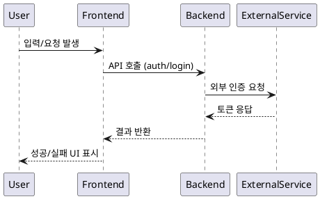

# 🔗 외부 연동 서비스 설계서 (Integration Spec)
> 파일 경로: `/docs/external/<service_name>.md`

---

## 1️⃣ 개요 (Overview)
| 항목 | 내용 |
|------|------|
| 서비스명 | 예: Supabase Auth / Stripe / Google Maps / Naver Cloud / OpenAI API |
| 목적 | (이 서비스가 시스템 내에서 수행하는 역할 요약) |
| 통신 방식 | REST / GraphQL / gRPC / WebSocket |
| 인증 방식 | API Key / OAuth 2.0 / JWT / Signed URL / Custom Header |
| 주요 사용 영역 | (참조 PAGE_ID 또는 FEATURE_ID) |
| 장애 시 대체 로직 | (Fallback 전략: 로컬 캐시, Mock API, Graceful degradation 등) |
| 데이터 분류 | 외부 출력 / 외부 입력 / 내부 전용 중 구분 |

---

## 2️⃣ 엔드포인트 요약 (Endpoint Summary)
| API ID | Method | Endpoint URL | 목적 | 인증 | 호출 주체 | 사용 페이지 |
|--------|---------|----------------|--------|---------|--------------|--------------|
| AUTH_01 | POST | `/auth/signup` | 회원가입 | JWT | FE → BE | P_SIGNUP |
| AUTH_02 | POST | `/auth/login` | 로그인 | JWT | FE → BE | P_LOGIN |
| GEO_01 | GET | `https://maps.googleapis.com/maps/api/geocode/json` | 좌표→주소 변환 | API Key | BE → Google | P_ADDRESS |

---

## 3️⃣ 상세 명세 (Detailed Specification)
각 API 별로 다음 형식을 반복합니다.

---

### 🔸 API ID: `{API_ID}`  
#### 🧭 목적
{이 API의 기능 목적을 구체적으로 작성 — 예: 사용자 인증 토큰을 발급받는다.}

#### 🔌 Endpoint

{HTTP_METHOD} {FULL_URL_PATH}

#### 🔐 인증
- 방식: (예: Bearer Token / API Key / OAuth2 Authorization Code)
- 헤더 예시:
  ```http
  Authorization: Bearer <JWT_TOKEN>
  Content-Type: application/json
  ```

#### 📤 Request

|필드	|타입|	필수	|설명	|유효성 규칙|
|--------|------|-------|--------|---------|
|email	|string|	✅	|사용자 이메일|	RFC5322 형식|
|password	|string	|✅|비밀번호	|최소 8자|
|device_id	|string|	❌	|디바이스 고유값	|UUID|

예시:
```json
{
  "email": "user@example.com",
  "password": "password123"
}
```
#### 📥 Response

|필드	|타입	|설명	|예시|
|-----|-----|-----|-----|
|token|	string|	JWT 토큰|	“eyJhbGciOi…”|
|user_id	|uuid	|사용자 ID	|“f0b5c…”|
expires_in|	number	|만료시간(초)|	3600|

예시:
```json
{
  "token": "eyJhbGciOi...",
  "user_id": "f0b5c...",
  "expires_in": 3600
}
```
#### ⚠️ 오류 코드 정의

|코드	|HTTP Status	|의미	|처리 방식|
|-----|-----|-----|-----|
|E401	|401	|인증 실패	|로그인 화면으로 이동|
|E409	|409	|중복된 이메일	|경고 메시지 표시|
|E500|500|서버 오류	|재시도 3회, 이후 fallback 실행|

#### 🕐 Rate Limit
	-	초당 최대 10건, burst 20건
	-	초과 시 429 응답 → exponential backoff (1s, 2s, 4s)

#### 🧠 비고
	-	API Key는 서버 환경 변수(process.env.API_KEY)로 관리.
	-	테스트 환경(staging)에서는 Mock 서버 URL로 교체:

```
MOCK_URL = https://mock.api.dev/v1/auth/signup
```


⸻

#### 4️⃣ 데이터 매핑 (Integration Mapping)

|내부 데이터 모델|외부 필드|변환 규칙|보안 수준	|저장 위치|
|-----|-----|-----|-----|-----|
|User.email	|email|lowercase 처리|민감정보|encrypted_column|
|User.token|	token|	그대로 저장	|고보안|	localStorage|
|Address.latlng	|geometry.location	|float→decimal 변환	|비민감	|DB column|


⸻

#### 5️⃣ 에러 처리 및 복구 전략 (Error Handling)

|상황|	감지 위치|	복구 방식|	사용자 알림	|재시도 정책|
|-----|-----|-----|-----|-----|
|네트워크 장애	|FE axios interceptor	|로컬 큐 저장 후 재전송	|“연결 재시도 중”|	3회 backoff|
|인증 만료	|BE middleware	|refresh_token 재요청|자동 재로그인	|즉시 1회|
|외부 서버 다운	|BE API Gateway	|fallback 응답 반환	|“일시적 오류”	|1분 후 재시도|


⸻

#### 6️⃣ 보안 및 개인정보 (Security & Privacy)
	-	민감정보 저장 금지: 비밀번호, 카드번호, 주민번호 등 저장하지 않음.
	-	TLS 1.3 강제, HTTP 요청은 전부 HTTPS 리다이렉션.
	-	로그 마스킹 규칙:

```
email → u***@example.com
token → 8자리만 표시
```
	-	API Key 보관: 환경 변수(.env, secret manager), 절대 코드에 직접 포함 금지.
	-	권한 제어:
	-	user.role == ‘admin’ 일 때만 특정 엔드포인트 접근 가능
	-	role 기반 access control (RBAC) 정의

⸻

#### 7️⃣ 테스트 시나리오 (Integration Tests)

테스트 ID	|목적|	시나리오	|기대 결과|
|-----|-----|-----|-----|
|EXT_01	|정상 로그인|	올바른 자격증명 전송|	200, JWT 반환|
|EXT_02|	잘못된 패스워드|	로그인 요청	|401 반환|
|EXT_03	|서버 다운|	API Timeout 발생	|fallback 동작 확인|
|EXT_04	|Rate limit 초과|	20회 요청	|429 + backoff|


⸻

#### 8️⃣ 시퀀스 다이어그램 (PlantUML)


⸻

#### 9️⃣ 운영 및 모니터링 (Ops & Monitoring)

항목	도구	설명
|-----|-----|-----|
|로그 수집|	Datadog / Grafana Loki|	외부 API latency, 오류 비율|
|알림	|Slack webhook	|5xx 발생 시 경고|
|헬스체크|	/health/external/<service>	|주기적 ping (5분 간격)|
|버전 관리	|OpenAPI Spec v3	|문서화 자동화 (Swagger)|


⸻

#### 🔒 품질 체크리스트
	-	모든 엔드포인트 URL, Method, 인증방식 명시됨
	-	요청/응답 필드 타입 및 예시 포함
	-	오류 코드 정의와 처리 정책 명시
	-	Rate limit 및 재시도 정책 포함
	-	보안 규칙(키 관리, 로그 마스킹) 포함
	-	PlantUML 시퀀스 다이어그램 정상 문법
	-	테스트 시나리오 ≥ 3개 이상

⸻

#### 📁 파일 저장 경로

/docs/external/<service_name>.md

⸻

#### 🧭 문서 요약

|구분	|설명|
|-----|-----|
|1. 개요|	서비스의 역할 및 인증 구조|
|2. 엔드포인트|	URL, Method, 사용 목적|
|3. 상세 명세|	Request/Response 정의|
|4. 데이터 매핑|	내부 모델 ↔ 외부 필드|
|5. 에러 처리	|복구 정책 및 사용자 알림|
|6. 보안|	민감정보·권한 제어 규칙|
|7. 테스트|	통합 테스트 케이스|
|8. 다이어그램|	호출 시퀀스 명확화|
|9. 모니터링	|운영 상태 검증|


⸻


---

이 템플릿은 단일 API뿐 아니라 **여러 외부 서비스 문서(`external/supabase.md`, `external/stripe.md`, `external/openai.md`)**를 병렬로 작성할 수 있습니다.  
또한, 추후 ⑧ *내부·외부 커뮤니케이션 설계 문서*에서 이 외부 서비스 명세를 자동 참조하도록 구조화되어 있습니다.

