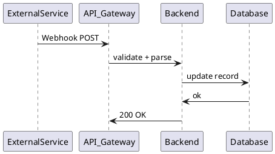

# 🌍 외부 커뮤니케이션 설계서 (External Communication Spec)
> 외부 서비스, 파트너, 제3자 시스템과의 통신 구조 정의

---

## 1️⃣ 개요
| 항목 | 내용 |
|------|------|
| 목적 | 외부 시스템과의 통합 구조 및 데이터 교환 정책 정의 |
| 주요 통신 대상 | Supabase / Stripe / Google API / OpenAI / 외부 파트너 API |
| 통신 방식 | REST / Webhook / gRPC / Socket / S3 Upload 등 |
| 인증 정책 | OAuth 2.0 / API Key / Service Account |
| 데이터 흐름 방향 | 양방향 / 단방향 (Outbound/Inbound 구분) |

---

## 2️⃣ 외부 연동 개요 (Integration Map)
| 서비스명 | 모듈 | 통신 방향 | 프로토콜 | 보안 방식 | 주요 목적 |
|-------|------|--------|--------|----------|----------|
| Supabase | MOD_AUTH | Outbound | REST | JWT | 인증, 데이터 저장 |
| Stripe | MOD_ORDER | Outbound + Webhook | HTTPS | Secret Key | 결제 처리 |
| Google Maps | MOD_ADDRESS | Outbound | HTTPS | API Key | 주소 변환 |
| OpenAI | MOD_AI | Outbound | REST | Bearer Token | AI 텍스트 생성 |

---

## 3️⃣ 외부 → 내부 (Inbound) 흐름
| 출처 | 수신 엔드포인트 | 데이터 형식 | 인증 | 처리 로직 |
|--------|----------------|--------------|------------|--------------|
| Stripe Webhook | `/api/webhook/payment` | JSON | Secret Signature | 결제 상태 갱신 |
| Supabase | `/api/auth/callback` | JWT | JWT Verify | 로그인 세션 확정 |
| Cloud Function | `/api/external/sync` | JSON | Token | 데이터 동기화 |

**다이어그램**

---

## 4️⃣ 내부 → 외부 (Outbound) 호출
| 호출 모듈 | 목적 | 대상 서비스 | 엔드포인트 | 인증 | 실패 처리 |
|---------|----------|----------|----------|---------|---------|
| MOD_ORDER | 결제 요청 | Stripe | `/v1/payment_intents` | Secret Key | 재시도 2회 |
| MOD_AI | 텍스트 생성 | OpenAI | `/v1/chat/completions` | Bearer Token | fallback model 사용 |
| MOD_ANALYTICS | 로그 전송 | Google Analytics | `/collect` | Measurement ID | 비동기 큐 저장 |

---

## 5️⃣ 데이터 포맷 표준화
- 모든 외부 JSON 통신은 UTF-8, snake_case
- 타임스탬프는 ISO8601 UTC
- 필드 누락 시 명시적 null 사용
- 외부 응답 필드는 내부 데이터 스키마(`/docs/database.md`)와 매핑해야 함

예시:
```json
{
  "user_id": "uuid",
  "event": "order_created",
  "created_at": "2025-10-28T12:00:00Z"
}
```

## 6️⃣ 에러 및 재시도 정책

|오류 유형 |감지 위치 |대응 전략 |사용자 피드백|
|---------|--------|-------|-------|
|401 Unauthorized |BE → External|Access Token 재발급|자동 재로그인|
|429 Rate Limit| FE/BE|exponential backoff|“잠시 후 다시 시도”|
|5xx External Failure |BE |fallback 응답 or 캐시 데이터 사용 |“서비스 지연 안내”|

## 7️⃣ 보안·로깅 정책
-	모든 외부 요청 로그는 masking 필수 (token, card_no 등)
-	API Key는 .env 또는 Secret Manager 사용
-	Webhook 검증 시 HMAC-SHA256 signature 필수
-	요청/응답 1건당 trace_id 부여 → 중앙 로깅 시스템과 연동

## 8️⃣ 모니터링 및 알림
|항목 |도구 |주기| 설명 |
|---------|----------|----------|----------|
|외부 API latency | Datadog|실시간|SLA 추적|
|Webhook 수신 실패 |Slack|즉시 |관리자 알림|
|Access Token 만료율 | Grafana |1시간 |인증 시스템 검증|

## ✅ 체크리스트
	-	모든 외부 서비스가 명시됨
	-	Inbound/Outbound 흐름 구분
	-	인증·보안·로깅 정책 포함
	-	오류 및 재시도 정책 존재
	-	PlantUML 다이어그램 문법 유효
	-	모니터링 및 SLA 항목 존재

## 📁 저장 경로

/docs/external-communication.md


---

# 🧭 문서 구조 요약

| 문서 | 역할 | 주요 내용 |
|------|------|-------------|
| `/docs/internal-communication.md` | 내부 데이터 및 이벤트 흐름 | Store, API, DB, EventBus 간 관계 |
| `/docs/external-communication.md` | 외부 서비스 및 파트너 통신 | Webhook, API, 보안, 모니터링 |

