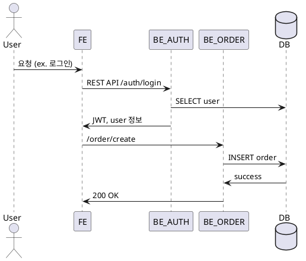
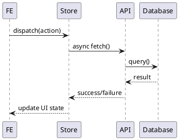

# 🧠 내부 커뮤니케이션 설계서 (Internal Communication Spec)
> 시스템 내 주요 모듈, 서비스, 페이지, 상태스토어 간의 데이터 및 이벤트 흐름 정의

---

## 1️⃣ 개요
| 항목 | 내용 |
|------|------|
| 목적 | 내부 서비스 간 통신 및 데이터 교환 구조 정의 |
| 주요 통신 방식 | 함수 호출 / Context API / 이벤트 버스 / Message Channel / WebSocket |
| 포함 범위 | FE 모듈, BE 서비스, DB, 상태스토어 등 |
| 제외 범위 | 외부 연동 서비스 (`/docs/external/*.md` 참조) |
| 아키텍처 타입 | 클라이언트 모놀리식 / FE-BE 분리형 / 마이크로서비스 등 |

---

## 2️⃣ 시스템 모듈 개요
| 모듈 ID | 이름 | 책임 | 주요 Input | 주요 Output |
|----------|-------|--------|-------------|--------------|
| MOD_AUTH | 인증 모듈 | 사용자 인증 및 세션 관리 | 로그인 요청 | JWT, User Context |
| MOD_USER | 사용자 관리 | 프로필 CRUD | API / DB | User Entity |
| MOD_ORDER | 주문 처리 | 결제 및 상태 갱신 | 주문 요청 | Order 이벤트 |
| MOD_NOTIF | 알림 처리 | 토스트, 이메일, 푸시 전송 | 이벤트 트리거 | 알림 전달 |

---

## 3️⃣ 통신 구조 요약 (Data Flow Overview)



---

## 4️⃣ 이벤트 플로우 정의 (Event Bus / Pub-Sub)
| 이벤트명 | 발행 모듈 | 구독 모듈 | Payload 구조 | 설명 |
|-----------|--------------|--------------|---------------|------|
| EVT_USER_LOGIN | MOD_AUTH | MOD_NOTIF, MOD_ANALYTICS | { user_id, timestamp } | 로그인 시 통계 및 알림 발생 |
| EVT_ORDER_CREATED | MOD_ORDER | MOD_NOTIF | { order_id, total_price } | 주문 완료 후 푸시 발송 |
| EVT_THEME_CHANGED | UI | FE Store | { theme: "dark" } | 사용자 UI 모드 변경 |

---

## 5️⃣ 메시지 형식 (Standard Message Schema)
```json
{
  "event": "EVT_ORDER_CREATED",
  "timestamp": "2025-10-28T13:10:00Z",
  "payload": {
    "order_id": "ORD1234",
    "total_price": 49.99,
    "currency": "USD"
  },
  "meta": {
    "source": "frontend",
    "version": "1.0.0"
  }
}
```
	-	event: 이벤트명 (대문자 스네이크케이스)
	-	payload: 구체적 데이터 (비즈니스 도메인에 따라 구조 정의)
	-	meta: 출처, 버전, 추적 ID 등

## 6️⃣ 내부 호출 시퀀스 다이어그램




|오류 유형| 감지 위치 |복구 방법 |로그 수준 |사용자 영향|
|-------|-------|-------|-------|-------|
|Store 업데이트 실패|FE|rollback to lastState|warn|낮음|
|API 응답 지연|FE interceptor|loading indicator + retry(3회)|info|중간|
|이벤트 전송 실패|BE Queue|재시도 5회, DLQ 저장|error|없음(비동기)|


## 8️⃣ 성능 및 일관성 고려사항
- 	모든 이벤트는 idempotent 해야 함 (중복 처리 방지)
- 	API 요청–응답 latency 목표: 200ms 이하
- 	데이터 일관성: write 후 read 시 stale < 1s
- 	상태스토어는 SSR 시 초기값을 주입받고, hydration 수행

## 9️⃣ 테스트 및 검증 시나리오
|테스트 ID |시나리오 |기대 결과 |
|---------|---------|--------|
|INT_001 |로그인 후 이벤트 발행 |EVT_USER_LOGIN 구독자 모두 수신|
|INT_002 |주문 생성 중 네트워크 오류| rollback + retry|
|INT_003| FE Store 갱신 실패 |이전 상태 유지, warn 로그 출력|


⸻

## ✅ 체크리스트
-	모든 모듈 간 데이터 흐름 명시됨
-	이벤트명 충돌 없음
-	메시지 구조 일관성 있음
-	다이어그램 문법 검증 완료
-	오류·재시도 정책 명시

## 📁 저장 경로

/docs/internal-communication.md
