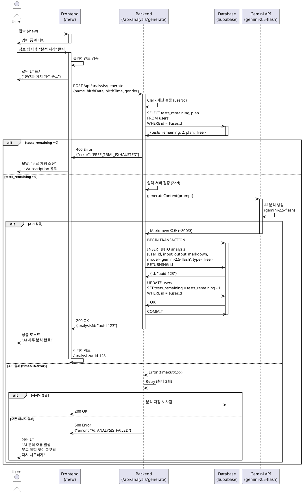

# UC-001: AI 사주 분석 요청 (무료 체험)

**Feature ID**: 005
**Version**: 1.0.0
**Date**: 2025-01-06
**Status**: Ready for Implementation

---

## Primary Actor

**무료 사용자 (Free User)**
- 로그인 완료된 사용자
- plan='free' 상태
- tests_remaining > 0

---

## Precondition

- 사용자가 Clerk를 통해 인증 완료
- Supabase `users` 테이블에 사용자 레코드 존재
- `plan='free'` 상태
- `tests_remaining >= 1` (최소 1회 이상 남아있음)

---

## Trigger

사용자가 다음 중 하나의 액션 수행:
- 대시보드에서 **"오늘의 사주 받기"** 버튼 클릭
- 직접 `/new` 페이지 URL 접속
- 상단 메뉴에서 **"사주 분석"** 메뉴 클릭

---

## Main Scenario

### 1. 입력 폼 표시
- 사용자가 `/new` 페이지 진입
- 시스템이 사주 분석 입력 폼 렌더링:
  - **이름** (필수, text)
  - **생년월일** (필수, YYYY-MM-DD)
  - **출생시간** (선택, HH:MM 또는 "모름")
  - **성별** (필수, radio: 남성/여성)
- 로딩 상태가 아닐 때 "AI 사주 분석 시작하기" 버튼 활성화

### 2. 사용자 입력 및 제출
- 사용자가 정보 입력 후 "AI 사주 분석 시작하기" 클릭
- 프론트엔드가 입력 값 유효성 검증:
  - 이름: 1자 이상
  - 생년월일: 유효한 날짜, 1900-01-01 ~ 오늘
  - 성별: 남성/여성 중 선택
- 검증 실패 시 인라인 에러 메시지 표시

### 3. 무료 체험 잔여 횟수 확인
- `/api/analysis/generate` POST 요청
- 백엔드가 Clerk 세션에서 `userId` 추출
- Supabase에서 잔여 횟수 조회:
  ```sql
  SELECT tests_remaining, plan
  FROM users
  WHERE id = $userId
  ```
- **분기 처리**:
  - `tests_remaining > 0` → 4단계로 진행
  - `tests_remaining = 0` → Edge Case 1 처리

### 4. AI 분석 생성 (로딩 상태)
- 프론트엔드가 로딩 UI 표시:
  - 진행률 바 0 → 100%
  - 순차 메시지:
    1. "천간과 지지를 해석하는 중입니다..."
    2. "오행의 균형을 분석하고 있습니다..."
    3. "오늘의 운세를 정리하는 중입니다..."
- 백엔드가 Gemini API 호출:
  ```typescript
  const result = await generateFreeSajuAnalysis({
    name: input.name,
    birthDate: input.birthDate,
    birthTime: input.birthTime,
    gender: input.gender
  });
  ```
- 모델: `gemini-2.5-flash`
- 프롬프트: `/docs/prompt/daily-saju.md` 템플릿 사용

### 5. 분석 결과 저장
- Supabase `analysis` 테이블에 INSERT:
  ```sql
  INSERT INTO analysis (user_id, input, output_markdown, model, type)
  VALUES (
    $userId,
    '{"name":"홍길동","birthDate":"1990-01-01","birthTime":"14:00","gender":"male"}',
    $aiOutput,
    'gemini-2.5-flash',
    'free'
  )
  RETURNING id
  ```

### 6. 무료 체험 횟수 차감
- Supabase `users` 테이블 UPDATE:
  ```sql
  UPDATE users
  SET tests_remaining = tests_remaining - 1
  WHERE id = $userId
  ```

### 7. 결과 페이지 이동
- 백엔드가 생성된 `analysis.id` 반환
- 프론트엔드가 `/analysis/[id]` 페이지로 리다이렉트
- 성공 토스트: "AI 사주 분석이 완료되었습니다!"

---

## Edge Cases

### EC-1: 무료 체험 소진 (tests_remaining = 0)

**Trigger**: 3단계에서 `tests_remaining = 0` 확인

**처리**:
1. 백엔드가 400 에러 응답:
   ```json
   {
     "error": "FREE_TRIAL_EXHAUSTED",
     "message": "무료 체험이 모두 소진되었습니다"
   }
   ```
2. 프론트엔드가 모달 표시:
   - 제목: "무료 체험이 모두 소진되었습니다"
   - 내용: "AI가 분석한 정확한 운세를 매일 받아보세요"
   - CTA: "365일 운세 시작하기 (월 ₩3,650)"
3. 모달 확인 시 `/subscription` 페이지로 이동

**Expected Outcome**: 사용자가 구독 전환 유도됨

---

### EC-2: Gemini API 오류 (timeout, rate limit, server error)

**Trigger**: 4단계에서 Gemini API 호출 실패

**처리**:
1. 백엔드가 retry 로직 수행 (최대 3회, exponential backoff)
2. 모든 재시도 실패 시:
   - `tests_remaining` 복구 (차감 전 상태로 롤백)
   - 500 에러 응답:
     ```json
     {
       "error": "AI_ANALYSIS_FAILED",
       "message": "AI 분석 중 오류가 발생했습니다"
     }
     ```
3. 프론트엔드가 에러 UI 표시:
   - "AI 분석 중 오류가 발생했습니다"
   - "무료 체험 횟수는 복구되었습니다"
   - "다시 분석하기" 버튼 제공

**Expected Outcome**: 사용자가 체험권 손실 없이 재시도 가능

---

### EC-3: 입력 유효성 실패

**Trigger**: 2단계에서 클라이언트 또는 서버 검증 실패

**처리**:
1. 클라이언트:
   - 해당 필드에 인라인 에러 메시지 표시
   - 제출 버튼 비활성화 유지
2. 서버 (이중 검증):
   - 400 에러 응답 with Zod validation errors
   - 프론트엔드가 해당 필드에 에러 표시

**Expected Outcome**: 사용자가 올바른 형식으로 입력 수정

---

### EC-4: 네트워크 타임아웃 / 새로고침

**Trigger**: 4-5단계 중 네트워크 연결 끊김

**처리**:
1. 프론트엔드가 입력값을 `localStorage`에 자동 저장
2. 재접속 시 `/new` 페이지에서 복원 토스트 표시:
   - "이전 입력을 복원하시겠습니까?"
   - "복원" / "새로 작성" 버튼
3. 복원 선택 시 폼에 자동 입력

**Expected Outcome**: 사용자가 재입력 부담 없이 계속 진행

---

### EC-5: 동시 요청 (중복 제출)

**Trigger**: 사용자가 로딩 중 "분석 시작" 버튼 반복 클릭

**처리**:
1. 프론트엔드가 제출 중 버튼 비활성화
2. 백엔드가 idempotency key로 중복 요청 감지
3. 이미 진행 중인 요청이 있으면 409 에러 반환

**Expected Outcome**: 중복 분석 생성 방지

---

## Business Rules

### BR-1: 무료 체험 제한
- 신규 가입자는 `tests_remaining=3`으로 시작
- 분석 성공 시에만 차감 (API 오류 시 차감 안 됨)
- `tests_remaining=0`이 되면 더 이상 분석 불가
- 구독 전환 시 `tests_remaining`은 유지되지 않음 (무의미)

### BR-2: AI 모델 선택
- 무료 사용자: `gemini-2.5-flash` 고정
- 응답 평균 시간: 3-8초
- 응답 평균 길이: 800자 (간결형)

### BR-3: 프롬프트 구성
- 템플릿: `/docs/prompt/daily-saju.md`
- 입력 변수: `{name}`, `{birthDate}`, `{birthTime}`, `{gender}`, `{todayDate}`
- 출생시간 없을 시 "모름"으로 대체
- 오늘 날짜는 서버 시간 기준 (KST)

### BR-4: 데이터 저장
- 모든 분석 결과는 영구 저장 (`analysis` 테이블)
- `type='free'` 태그로 무료 체험 분석 식별
- 사용자 삭제 시 CASCADE로 분석 결과도 삭제
- 저장 실패 시 `tests_remaining` 차감 안 됨

### BR-5: 응답 시간 목표
- 총 처리 시간: < 15초
  - 입력 검증: < 0.5초
  - Gemini API: < 10초
  - DB 저장: < 1초
  - 리다이렉트: < 0.5초
- 15초 초과 시 타임아웃 처리

---

## External Service Integration

### Gemini API (google-generative-ai)

**Purpose**: AI 사주 분석 생성

**Model**: `gemini-2.5-flash`

**Request**:
```typescript
import { generateFreeSajuAnalysis } from '@/lib/gemini';

const result = await generateFreeSajuAnalysis({
  name: "홍길동",
  birthDate: "1990-01-01",
  birthTime: "14:00",
  gender: "male"
});
```

**Response**: Markdown 형식 텍스트 (약 800자)

**Error Handling**:
- Retry: 최대 3회, exponential backoff (1s, 2s, 4s)
- Timeout: 10초
- Rate Limit: 429 에러 시 백오프
- Server Error (5xx): 재시도 후 실패 시 사용자 안내

**Reference**: `/docs/external/gemini-integration-guide.md`

---

### Database Security (Supabase)

**Purpose**: 데이터베이스 접근 제어 및 보안

**Architecture**: Clerk Auth + Supabase Service Role

**Security Model**:
```
Client → Clerk Auth → Next.js API Routes → Supabase (Service Role Key)
```

**Key Points**:
1. **클라이언트는 Supabase에 직접 접근하지 않음**
   - 모든 DB 작업은 API Routes를 통해서만 수행
   - Service Role Key는 서버 환경에서만 사용

2. **Row Level Security (RLS) 정책**
   ```sql
   -- users 테이블
   CREATE POLICY "service_role_all_users"
     ON users FOR ALL
     USING (auth.role() = 'service_role')
     WITH CHECK (auth.role() = 'service_role');

   -- analysis 테이블
   CREATE POLICY "service_role_all_analysis"
     ON analysis FOR ALL
     USING (auth.role() = 'service_role')
     WITH CHECK (auth.role() = 'service_role');
   ```

3. **권한 검증**
   - API Route에서 Clerk 세션 검증
   - 사용자 본인 데이터만 조회/수정 (애플리케이션 레벨)
   - Clerk userId로 필터링

4. **Why This Approach?**
   - Clerk user ID는 TEXT 타입
   - Supabase auth.uid()는 UUID 타입
   - 타입 불일치 문제 회피
   - 중앙화된 권한 관리

**Example**:
```typescript
import { auth } from '@clerk/nextjs';
import { createClient } from '@/lib/supabase/server';

export async function GET(req: Request) {
  // 1. Clerk 세션 검증
  const { userId } = auth();
  if (!userId) {
    return new Response('Unauthorized', { status: 401 });
  }

  // 2. Service Role로 Supabase 접근
  const supabase = await createClient();

  // 3. 사용자 본인 데이터만 조회
  const { data } = await supabase
    .from('users')
    .select('*')
    .eq('id', userId)
    .single();

  return Response.json(data);
}
```

**Reference**: `/docs/database.md` (RLS section)

---

## Sequence Diagram



---

## Success Criteria

### 기능 완료 조건
- [ ] 사용자가 생년월일 정보 입력 후 AI 분석 결과 획득
- [ ] 무료 체험 1회 정상 차감
- [ ] 분석 결과가 `analysis` 테이블에 저장됨
- [ ] `/analysis/[id]` 페이지로 자동 이동
- [ ] 체험 소진 시 구독 페이지로 유도

### 성능 목표
- [ ] 총 처리 시간 < 15초 (P95)
- [ ] Gemini API 호출 성공률 > 99%
- [ ] 동시 사용자 100명 처리 가능

### UX 목표
- [ ] 로딩 중 진행 메시지로 몰입감 제공
- [ ] API 오류 시 체험권 복구로 신뢰 확보
- [ ] 입력값 자동 저장으로 재접속 편의성 제공

---

## References

- Feature Specification: `/docs/userflow.md` (Feature 005)
- Database Schema: `/docs/database.md` (users, analysis)
- AI Prompt Template: `/docs/prompt/daily-saju.md`
- Gemini Integration Guide: `/docs/external/gemini-integration-guide.md`
- Implementation: `src/lib/gemini.ts`, `src/app/api/analysis/generate/route.ts`
