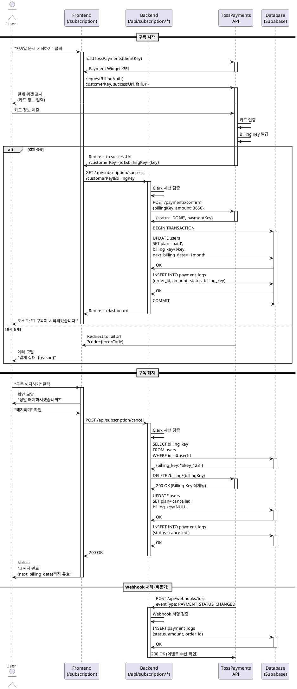

# UC-002: 구독 관리 (결제 및 해지)

**Feature ID**: 009, 010
**Version**: 1.0.0
**Date**: 2025-01-06
**Status**: Ready for Implementation

---

## Primary Actor

**무료 사용자 (Free User)** - 구독 시작
**유료 구독자 (Pro User)** - 구독 관리/해지

---

## Precondition

### 구독 시작 (Feature 009)
- 사용자가 Clerk를 통해 인증 완료
- `plan='free'` 상태
- `tests_remaining=0` (무료 체험 소진) 또는 자발적 구독 의향

### 구독 관리 (Feature 010)
- `plan='paid'` 상태
- `billing_key` 존재
- `next_billing_date` 설정됨

---

## Trigger

### 구독 시작
- 무료 체험 소진 후 "365일 운세 시작하기" 클릭
- 대시보드 또는 분석 결과 페이지의 "구독하기" CTA 클릭
- 직접 `/subscription` 페이지 접속

### 구독 관리
- `/subscription` 페이지에서 "구독 해지하기" 클릭
- 결제 실패 배너에서 "재결제 시도" 클릭

---

## Main Scenario: 구독 시작 (Feature 009)

### 1. 구독 페이지 진입
- 사용자가 `/subscription` 접속
- 시스템이 현재 플랜 상태 조회:
  ```sql
  SELECT plan, tests_remaining, next_billing_date, billing_key
  FROM users
  WHERE id = $userId
  ```
- 플랜 정보 카드 표시:
  - 현재 플랜: 무료 체험 (남은 X회)
  - 제안: 365일 운세 (월 ₩3,650)
  - 혜택: 매일 자동 생성되는 AI 운세, 언제든 해지 가능
- CTA 버튼: "365일 운세 시작하기"

### 2. 결제 수단 등록 (TossPayments SDK)
- 사용자가 "365일 운세 시작하기" 클릭
- TossPayments Payment Widget 로드:
  ```typescript
  const tossPayments = await loadTossPayments(clientKey);
  await tossPayments.requestBillingAuth({
    customerKey: userId,
    successUrl: '/api/subscription/success',
    failUrl: '/subscription?error=payment_failed'
  });
  ```
- TossPayments 결제창 표시
- 사용자가 카드 정보 입력:
  - 카드번호
  - 유효기간
  - CVC
  - 카드 비밀번호 앞 2자리

### 3. Billing Key 발급 및 첫 결제
- TossPayments가 카드 인증 완료
- `billing_key` 발급
- 첫 결제 자동 청구 (₩3,650)
- Success URL 콜백: `/api/subscription/success?customerKey={userId}&billingKey={key}`

### 4. 서버 처리 (Success Callback)
- Clerk 세션 검증
- TossPayments API로 결제 승인:
  ```typescript
  const payment = await toss.confirmPayment({
    billingKey,
    customerKey: userId,
    amount: 3650,
    orderId: generateOrderId(),
    orderName: '365일 운세 월 구독'
  });
  ```
- Supabase 트랜잭션 시작:
  ```sql
  BEGIN;

  -- 1. users 테이블 업데이트
  UPDATE users
  SET plan = 'paid',
      billing_key = $billingKey,
      next_billing_date = CURRENT_DATE + INTERVAL '1 month',
      tests_remaining = 365,
      updated_at = NOW()
  WHERE id = $userId;

  -- 2. payment_logs 기록
  INSERT INTO payment_logs (
    user_id, order_id, amount, status,
    billing_key, payment_key, approved_at
  ) VALUES (
    $userId, $orderId, 3650, 'success',
    $billingKey, $paymentKey, NOW()
  );

  COMMIT;
  ```

### 5. 구독 완료 안내
- `/dashboard` 페이지로 리다이렉트
- 축하 토스트 표시:
  - "🎉 365일 운세 구독이 시작되었습니다!"
  - "매일 오전 6시에 오늘의 사주가 자동으로 생성됩니다"
- 상태 카드 갱신:
  - "현재 플랜: 365일 운세 (월 ₩3,650)"
  - "다음 결제일: YYYY-MM-DD"

---

## Main Scenario: 구독 해지 (Feature 010)

### 1. 해지 요청
- 유료 구독자가 `/subscription` 페이지 접속
- 현재 구독 정보 표시:
  - 플랜: 365일 운세 (월 ₩3,650)
  - 다음 결제일: YYYY-MM-DD
  - 구독 시작일: YYYY-MM-DD
- "구독 해지하기" 버튼 클릭

### 2. 해지 확인 모달
- 모달 표시:
  - 제목: "정말 해지하시겠습니까?"
  - 내용:
    - "다음 결제일({next_billing_date})까지 서비스는 계속 이용하실 수 있습니다"
    - "해지 후에도 분석 히스토리는 유지됩니다"
  - 버튼: "취소" / "해지하기"
- 사용자가 "해지하기" 확인

### 3. Billing Key 삭제
- `/api/subscription/cancel` POST 요청
- TossPayments Billing Key 비활성화:
  ```typescript
  await toss.deleteBillingKey(billingKey);
  ```
- Supabase 업데이트:
  ```sql
  UPDATE users
  SET plan = 'cancelled',
      billing_key = NULL,
      updated_at = NOW()
  WHERE id = $userId;
  ```
- `payment_logs` 기록:
  ```sql
  INSERT INTO payment_logs (
    user_id, order_id, amount, status, approved_at
  ) VALUES (
    $userId, 'cancellation_' || $userId, 0, 'cancelled', NOW()
  );
  ```

### 4. 해지 완료 안내
- 토스트 표시:
  - "🧾 구독이 해지되었습니다"
  - "{next_billing_date}까지 서비스를 이용하실 수 있습니다"
- 상태 카드 갱신:
  - "플랜: 해지 예정 ({next_billing_date}까지 유효)"
  - "재구독하기" 버튼 활성화

### 5. 만료 처리 (Cron)
- `next_billing_date` 도래 시 Supabase Cron 실행
- 자동 전환:
  ```sql
  UPDATE users
  SET plan = 'free',
      tests_remaining = 0,
      next_billing_date = NULL
  WHERE plan = 'cancelled'
    AND next_billing_date <= CURRENT_DATE;
  ```

---

## Main Scenario: 결제 실패 재시도 (Feature 010)

### 1. 결제 실패 감지
- Cron 또는 Webhook이 결제 실패 감지
- `plan='suspended'` 상태로 변경
- 사용자 대시보드에 배너 표시:
  - "⚠️ 결제 실패 - 카드 정보를 확인해주세요"
  - "재결제 시도" 버튼

### 2. 재결제 시도
- 사용자가 "재결제 시도" 클릭
- `/api/subscription/retry` POST 요청
- 기존 `billing_key`로 재청구:
  ```typescript
  const payment = await toss.requestPayment({
    billingKey,
    amount: 3650,
    orderId: generateOrderId(),
    orderName: '365일 운세 월 구독 (재시도)'
  });
  ```

### 3. 재결제 성공
- Supabase 업데이트:
  ```sql
  UPDATE users
  SET plan = 'paid',
      next_billing_date = CURRENT_DATE + INTERVAL '1 month'
  WHERE id = $userId;
  ```
- 토스트: "✅ 결제가 완료되었습니다"

### 4. 재결제 실패
- 에러 모달 표시:
  - "결제에 실패했습니다"
  - 실패 사유 (카드 한도 초과, 정지된 카드 등)
  - "새 결제 수단 등록하기" CTA
- 클릭 시 2단계 (결제 수단 등록)로 이동

---

## Edge Cases

### EC-1: 이미 구독 중인 사용자가 재구독 시도

**Trigger**: `plan='paid'` 상태에서 "구독하기" 클릭

**처리**:
1. 백엔드가 플랜 상태 확인
2. 409 에러 응답:
   ```json
   {
     "error": "ALREADY_SUBSCRIBED",
     "message": "이미 구독 중입니다"
   }
   ```
3. 프론트엔드가 안내 모달 표시:
   - "이미 365일 운세를 구독 중입니다"
   - "대시보드로 이동" 버튼

**Expected Outcome**: 중복 구독 방지

---

### EC-2: 결제 승인 타임아웃

**Trigger**: TossPayments API 호출이 10초 초과

**처리**:
1. 클라이언트가 대기 UI 표시
2. 30초 후에도 응답 없으면:
   - "결제 처리 중입니다. 잠시 후 대시보드에서 확인해주세요" 안내
   - `/dashboard`로 이동
3. 백엔드는 비동기로 처리 계속:
   - 성공 시 `users` 업데이트
   - 실패 시 Webhook으로 재처리

**Expected Outcome**: 사용자 대기 시간 최소화

---

### EC-3: Webhook 수신 실패

**Trigger**: TossPayments Webhook이 서버에 도달하지 못함

**처리**:
1. Supabase Cron이 미처리 결제 탐지 (backup):
   ```sql
   SELECT * FROM users
   WHERE plan = 'paid'
     AND next_billing_date = CURRENT_DATE
     AND billing_key IS NOT NULL
     AND id NOT IN (
       SELECT user_id FROM payment_logs
       WHERE DATE(approved_at) = CURRENT_DATE
     );
   ```
2. 해당 사용자에게 수동 결제 재시도
3. 관리자 알림 전송

**Expected Outcome**: Webhook 실패해도 결제 누락 방지

---

### EC-4: 결제 취소 중 에러

**Trigger**: TossPayments Billing Key 삭제 API 오류

**처리**:
1. 재시도 로직 (최대 3회)
2. 모든 재시도 실패 시:
   - Supabase에 `plan='cancelled'` 상태는 유지
   - `billing_key`만 NULL 처리
   - 관리자에게 수동 확인 요청 로그 생성
3. 사용자에게는 "해지 완료" 안내 (next_billing_date까지 유효)

**Expected Outcome**: 사용자 경험 저해 없이 수동 처리

---

### EC-5: 중복 결제 방지

**Trigger**: 사용자가 결제 버튼 연속 클릭

**처리**:
1. 프론트엔드가 버튼 비활성화 (클릭 1회만)
2. 백엔드가 `order_id` 중복 확인:
   ```sql
   SELECT * FROM payment_logs WHERE order_id = $orderId;
   ```
3. 이미 존재하면 409 에러 반환
4. Idempotency key 사용 (TossPayments SDK)

**Expected Outcome**: 중복 청구 방지

---

## Business Rules

### BR-1: 구독 가격 정책
- 월 구독: ₩3,650 (하루 약 ₩120)
- 연 구독: 미지원 (MVP)
- 환불: 구독 해지 시 즉시 적용, 잔여 기간 환불 없음

### BR-2: Billing Key 관리
- Billing Key는 TossPayments가 발급
- `users.billing_key`에 암호화 없이 저장 (TossPayments 권장)
- 해지 시 즉시 삭제 (재구독 시 재발급)
- Billing Key 만료 시 자동 갱신 (TossPayments 자동 처리)

### BR-3: 구독 상태 전환 규칙
```
free → paid (구독 시작)
paid → cancelled (사용자 해지)
cancelled → free (만료일 도래)
paid → suspended (결제 실패)
suspended → paid (재결제 성공)
```

### BR-4: 결제 실패 정책
- 첫 결제 실패: `plan='suspended'` 전환
- 7일 내 재결제 없으면 → `plan='free'` 강제 전환
- 사용자에게 이메일 알림 (1일차, 3일차, 7일차)

### BR-5: 정기결제 자동화
- 매월 `next_billing_date`에 자동 청구
- Webhook 우선, Cron 백업 (fail-safe)
- 성공 시 `next_billing_date` +1개월
- 실패 시 BR-4 정책 적용

### BR-6: 성능 목표 (Non-Functional Requirements)
- **결제 처리 시간**: < 3초 (P95)
  - Billing Auth 요청: < 2초
  - 결제 승인 API: < 1초
- **Webhook 처리**: < 1초
- **결제 성공률**: > 95%
- **TossPayments API 가용성**: > 99.9%
- **동시 결제 처리**: 100 TPS 지원

---

## External Service Integration

### TossPayments SDK (Client)

**Purpose**: 결제 수단 등록 및 결제 위젯 렌더링

**Implementation**:
```typescript
import { loadTossPayments } from '@tosspayments/payment-widget-sdk';

const tossPayments = await loadTossPayments(clientKey);

// Billing Auth (정기결제 등록)
await tossPayments.requestBillingAuth({
  customerKey: userId,
  successUrl: '/api/subscription/success',
  failUrl: '/subscription?error=true'
});
```

**Reference**: `/docs/external/tosspayments-webhook-guide.md`

---

### TossPayments API (Server)

**Purpose**: 결제 승인, Billing Key 관리

**Endpoints**:
1. **결제 승인**
   ```typescript
   POST https://api.tosspayments.com/v1/payments/confirm
   Authorization: Basic {base64(secretKey:)}
   Body: { billingKey, customerKey, amount, orderId, orderName }
   ```

2. **Billing Key 삭제**
   ```typescript
   DELETE https://api.tosspayments.com/v1/billing/{billingKey}
   Authorization: Basic {base64(secretKey:)}
   ```

3. **결제 취소**
   ```typescript
   POST https://api.tosspayments.com/v1/payments/{paymentKey}/cancel
   Body: { cancelReason }
   ```

**Error Handling**:
- 400: 잘못된 요청 → 사용자 입력 검증
- 401: 인증 실패 → Secret Key 확인
- 404: 존재하지 않는 결제 → 로그 기록
- 500: 서버 오류 → 재시도 (최대 3회)

---

### TossPayments Webhook

**Purpose**: 결제 상태 변경 이벤트 수신

**Endpoint**: `/api/webhooks/toss`

**Events**:
- `PAYMENT_STATUS_CHANGED`: 결제 완료/실패/취소
- `BILLING_KEY_ISSUED`: Billing Key 발급
- `BILLING_KEY_DELETED`: Billing Key 삭제

**Signature Verification**:
```typescript
const signature = req.headers.get('TossPayments-Signature');
const expected = crypto
  .createHmac('sha512', TOSS_WEBHOOK_SECRET)
  .update(rawBody)
  .digest('hex');

if (signature !== expected) {
  return Response.json({ error: 'Invalid signature' }, { status: 401 });
}
```

---

### Database Security (Supabase)

**Purpose**: 구독 및 결제 데이터 보안 접근 제어

**Architecture**: Clerk Auth + Supabase Service Role

**Security Model**:
```
Client → Clerk Auth → Next.js API Routes → Supabase (Service Role Key)
```

**Protected Tables**:
1. **users**: plan, billing_key, next_billing_date
2. **payment_logs**: 결제 내역 (order_id, amount, status)

**RLS Policies**:
```sql
-- users 테이블 (구독 정보)
CREATE POLICY "service_role_all_users"
  ON users FOR ALL
  USING (auth.role() = 'service_role')
  WITH CHECK (auth.role() = 'service_role');

-- payment_logs 테이블 (결제 내역)
CREATE POLICY "service_role_all_payment_logs"
  ON payment_logs FOR ALL
  USING (auth.role() = 'service_role')
  WITH CHECK (auth.role() = 'service_role');
```

**Authorization Pattern**:
```typescript
import { auth } from '@clerk/nextjs';
import { createClient } from '@/lib/supabase/server';

export async function POST(req: Request) {
  // 1. Clerk 세션 검증
  const { userId } = auth();
  if (!userId) {
    return new Response('Unauthorized', { status: 401 });
  }

  // 2. Service Role로 Supabase 접근
  const supabase = await createClient();

  // 3. 사용자 본인 데이터만 조회/수정
  const { data } = await supabase
    .from('users')
    .select('plan, billing_key')
    .eq('id', userId)
    .single();

  // 4. 권한 검증
  if (data.plan !== 'free') {
    return new Response('Already subscribed', { status: 409 });
  }

  // ... 결제 처리
}
```

**Sensitive Data**:
- `billing_key`: TossPayments 발급, 평문 저장 (TossPayments 권장)
- `payment_key`: 결제 식별자, 환불 시 필요
- `order_id`: 결제 주문 ID, 유니크 제약

**Data Retention**:
- 회원 탈퇴 시 30일 후 `users`, `payment_logs` 전체 삭제
- CASCADE 정책으로 연관 데이터 자동 삭제

**Reference**: `/docs/database.md` (users, payment_logs, RLS)

---

## Sequence Diagram



---

## Success Criteria

### 기능 완료 조건
- [ ] 무료 사용자가 구독 결제 완료
- [ ] `billing_key` 저장 및 첫 결제 성공
- [ ] `plan='paid'` 상태 전환
- [ ] 유료 구독자가 해지 요청 성공
- [ ] 해지 후 `next_billing_date`까지 서비스 유지
- [ ] 결제 실패 시 재시도 경로 제공

### 성능 목표
- [ ] 결제 승인 시간 < 5초 (P95)
- [ ] Webhook 처리 시간 < 1초
- [ ] Billing Key 발급 성공률 > 99%

### UX 목표
- [ ] 결제 과정 직관적 (단계 명확)
- [ ] 해지 확인 모달로 실수 방지
- [ ] 결제 실패 시 명확한 안내 및 복구 경로

---

## References

- Feature Specification: `/docs/userflow.md` (Feature 009, 010)
- Database Schema: `/docs/database.md` (users, payment_logs)
- TossPayments Guide: `/docs/external/tosspayments-webhook-guide.md`
- Implementation: `src/app/api/subscription/`, `src/lib/tosspayments/`
