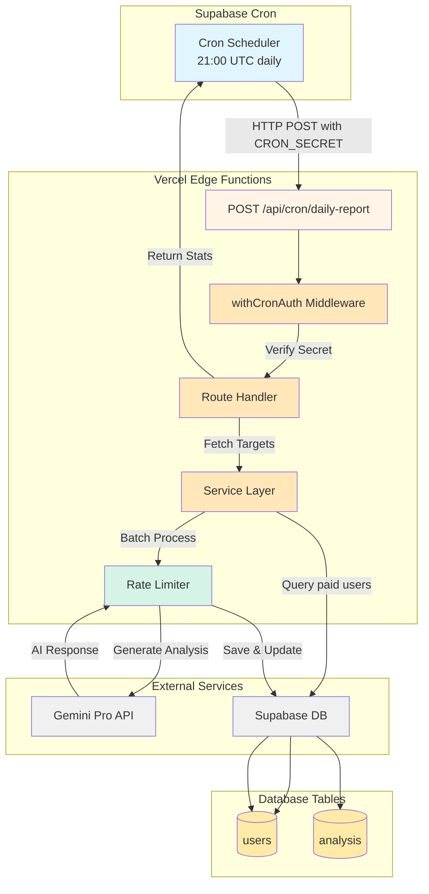
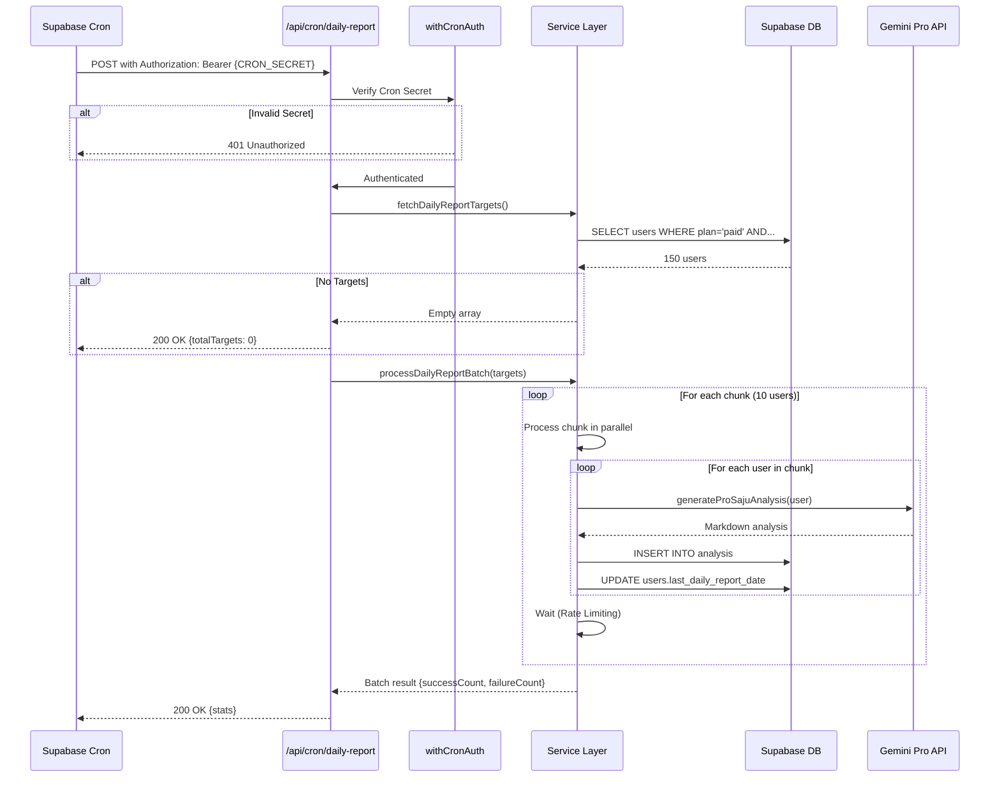

# 구현 계획: UC-003 일일 리포트 자동 생성 (Cron)

## 프로젝트 ID: PLAN-UC-003

### 제목
매일 자동 일일 사주 리포트 생성 Cron Job 시스템 구현

---

## 1. 개요

### 1.1 목표
Supabase Cron을 통해 매일 06:00 KST에 유료 구독자 전체에게 일일 사주 리포트를 자동 생성합니다. 배치 처리, 에러 핸들링, Rate Limiting, 모니터링에 중점을 두어 안정적이고 확장 가능한 시스템을 구축합니다.

### 1.2 참고 문서
- **유스케이스**: `/docs/usecases/003/spec.md`
- **데이터베이스 스키마**: `/docs/database.md`
- **유저 플로우**: `/docs/userflow.md` (Feature 011)
- **외부 서비스**: `/docs/external/gemini-integration-guide.md`
- **AI 프롬프트**: `/docs/prompts/daily-saju.md`
- **프로젝트 가이드**: `/CLAUDE.md`
- **Gemini 라이브러리**: `/src/lib/gemini.ts` (이미 구현됨)

### 1.3 범위

**포함 사항**:
- Cron 엔드포인트 (`POST /api/cron/daily-report`)
- Cron Secret 인증 미들웨어
- 배치 처리 로직 (최대 1000명, 청크 단위 처리)
- Gemini Pro 모델 연동 (재시도 로직 활용)
- Rate Limiting 및 Throttling (초당 1-2건)
- 실패 재시도 메커니즘 (다음 Cron 실행 시)
- 처리 통계 및 모니터링 로깅
- Supabase Cron 설정 SQL

**제외 사항**:
- 프론트엔드 UI (Cron Job은 백엔드만)
- 이메일/푸시 알림 (향후 구현)
- 사용자별 커스텀 스케줄 (모든 구독자 동일 시간)
- Redis 기반 Distributed Lock (Phase 1에서는 단순 날짜 기반 중복 방지)

---

## 2. 기술 스택

### 2.1 백엔드
- **프레임워크**: Hono (lightweight web framework)
- **데이터베이스**: Supabase (PostgreSQL) + Service Role Key
- **인증**: Cron Secret (환경 변수)
- **AI**: Google Gemini API (`gemini-2.5-pro`)
- **검증**: Zod (입력 유효성 검증)
- **에러 처리**: 커스텀 Result 타입 (`HandlerResult`)
- **Throttling**: Promise 기반 Rate Limiter

### 2.2 외부 서비스
- **Gemini API**: AI 일일 사주 분석 생성
  - 모델: `gemini-2.5-pro`
  - 타임아웃: 15초
  - 재시도: 최대 3회 (exponential backoff)
  - Rate Limit: 60 requests/minute (초당 1건으로 throttle)
- **Supabase Cron**: 매일 06:00 KST 트리거
  - Cron 표현식: `0 21 * * *` (UTC 21:00 = KST 06:00 다음날)
  - HTTP POST 방식

### 2.3 배치 처리 전략
- **배치 크기**: 최대 1000명 (LIMIT 1000)
- **청크 처리**: 10명씩 처리 (병렬 처리)
- **Throttling**: 청크 간 1초 대기 (Rate Limit 준수)
- **우선순위**: `last_daily_report_date ASC NULLS FIRST` (오래된 순)

---

## 3. 데이터베이스 마이그레이션

### 3.1 새로운 테이블
**없음** - 기존 `users`, `analysis` 테이블 사용

### 3.2 기존 테이블 수정
**없음** - 기존 스키마로 충분

### 3.3 인덱스 확인

다음 인덱스가 이미 정의되어 있는지 확인:

```sql
-- users 테이블: Cron 대상 조회 최적화
CREATE INDEX IF NOT EXISTS idx_users_plan_report_date
  ON users(plan, last_daily_report_date)
  WHERE plan = 'paid';

-- analysis 테이블: 사용자별 일일 리포트 조회
CREATE INDEX IF NOT EXISTS idx_analysis_user_type_date
  ON analysis(user_id, type, created_at DESC)
  WHERE type = 'daily';
```

### 3.4 Supabase Cron 설정

```sql
-- Supabase SQL Editor에서 실행
-- 매일 06:00 KST (UTC 21:00) 자동 실행
SELECT cron.schedule(
  'daily-saju-report-generation',
  '0 21 * * *',  -- 21:00 UTC = 06:00 KST (다음날)
  $$
  SELECT net.http_post(
    url := 'https://vcm-saju.vercel.app/api/cron/daily-report',
    headers := jsonb_build_object(
      'Content-Type', 'application/json',
      'Authorization', 'Bearer ' || current_setting('app.cron_secret')
    ),
    body := '{}'::jsonb
  );
  $$
);

-- Cron Secret 설정 (Supabase Dashboard → Settings → Vault)
-- Key: app.cron_secret
-- Value: [CRON_SECRET 환경 변수와 동일한 값]
```

### 3.5 Cron 실행 내역 조회

```sql
-- Cron 실행 상태 확인
SELECT
  jobid,
  jobname,
  start_time,
  end_time,
  status,
  return_message
FROM cron.job_run_details
WHERE jobname = 'daily-saju-report-generation'
ORDER BY start_time DESC
LIMIT 20;

-- 최근 7일간 성공률 통계
SELECT
  DATE(start_time AT TIME ZONE 'Asia/Seoul') as date,
  COUNT(*) as total_runs,
  SUM(CASE WHEN status = 'succeeded' THEN 1 ELSE 0 END) as success_runs,
  AVG(EXTRACT(EPOCH FROM (end_time - start_time))) as avg_duration_sec
FROM cron.job_run_details
WHERE jobname = 'daily-saju-report-generation'
  AND start_time > NOW() - INTERVAL '7 days'
GROUP BY DATE(start_time AT TIME ZONE 'Asia/Seoul')
ORDER BY date DESC;
```

---

## 4. 구현 단계 (Implementation Steps)

### Phase 1: Cron 인증 미들웨어 구현

**목표**: Cron Secret 검증 미들웨어 구축 및 무단 접근 차단

**작업 항목**:

#### 4.1.1 Cron Secret 환경 변수 추가
- **파일**: `.env.local`, Vercel 환경 변수
- **설명**: Cron Secret 키 생성 및 등록
- **내용**:
  ```bash
  # .env.local (로컬 개발)
  CRON_SECRET=your-random-secure-key-min-32-chars

  # Vercel Dashboard (Production)
  CRON_SECRET=your-random-secure-key-min-32-chars
  ```
- **생성 방법**:
  ```bash
  # Node.js로 랜덤 키 생성
  node -e "console.log(require('crypto').randomBytes(32).toString('hex'))"
  ```
- **의존성**: 없음

#### 4.1.2 Cron 인증 미들웨어 구현
- **파일**: `src/backend/middleware/cron-auth.ts`
- **설명**: Cron Secret 검증 미들웨어
- **내용**:
  ```typescript
  import type { MiddlewareHandler } from 'hono';
  import type { AppEnv } from '@/backend/hono/context';
  import { env } from '@/constants/env';

  /**
   * Cron Secret 검증 미들웨어
   * Authorization: Bearer {CRON_SECRET} 헤더 확인
   */
  export const withCronAuth = (): MiddlewareHandler<AppEnv> => {
    return async (c, next) => {
      const authHeader = c.req.header('authorization');

      if (!authHeader) {
        return c.json(
          { error: { code: 'UNAUTHORIZED', message: 'Missing authorization header' } },
          401
        );
      }

      const token = authHeader.replace('Bearer ', '');

      if (token !== env.CRON_SECRET) {
        const logger = c.get('logger');
        logger.error('Cron authentication failed', {
          ip: c.req.header('x-forwarded-for') || 'unknown',
          userAgent: c.req.header('user-agent'),
        });

        return c.json(
          { error: { code: 'UNAUTHORIZED', message: 'Invalid cron secret' } },
          401
        );
      }

      await next();
    };
  };
  ```
- **의존성**: 4.1.1

#### 4.1.3 환경 변수 스키마에 CRON_SECRET 추가
- **파일**: `src/constants/env.ts`
- **설명**: Cron Secret 환경 변수 타입 정의
- **수정 사항**:
  ```typescript
  // 기존 env.ts에 추가
  import { z } from 'zod';

  const envSchema = z.object({
    // ... 기존 환경 변수
    CRON_SECRET: z.string().min(32, 'CRON_SECRET must be at least 32 characters'),
  });

  export const env = {
    // ... 기존 환경 변수
    CRON_SECRET: process.env.CRON_SECRET!,
  };

  // 앱 시작 시 검증
  envSchema.parse(env);
  ```
- **의존성**: 4.1.1

**Acceptance Tests**:
- [ ] `CRON_SECRET` 환경 변수 미설정 시 앱 시작 실패
- [ ] Authorization 헤더 누락 시 401 에러 반환
- [ ] 잘못된 Cron Secret 사용 시 401 에러 + 로그 기록
- [ ] 올바른 Cron Secret 사용 시 다음 핸들러로 진행

---

### Phase 2: Cron 서비스 레이어 구현

**목표**: 배치 처리, 에러 핸들링, Throttling 로직 구현

**작업 항목**:

#### 4.2.1 Feature 폴더 구조 생성
- **파일**: `src/features/cron/backend/` 디렉토리 생성
- **설명**:
  ```
  src/features/cron/
  └── backend/
      ├── route.ts          # Hono 라우트 핸들러
      ├── service.ts        # 배치 처리 비즈니스 로직
      ├── schema.ts         # Zod 스키마 (요청/응답)
      └── error.ts          # 에러 코드 정의
  ```
- **의존성**: 없음

#### 4.2.2 에러 코드 정의
- **파일**: `src/features/cron/backend/error.ts`
- **설명**: Cron Job 관련 에러 코드 상수 정의
- **내용**:
  ```typescript
  export const cronErrorCodes = {
    // 인증
    unauthorized: 'CRON_UNAUTHORIZED',

    // 사용자 조회
    fetchTargetsFailed: 'FETCH_TARGETS_FAILED',
    noTargets: 'NO_TARGETS',

    // AI 분석
    aiGenerationFailed: 'AI_GENERATION_FAILED',
    aiTimeout: 'AI_TIMEOUT',
    aiEmptyResponse: 'AI_EMPTY_RESPONSE',

    // 데이터베이스
    saveAnalysisFailed: 'SAVE_ANALYSIS_FAILED',
    updateReportDateFailed: 'UPDATE_REPORT_DATE_FAILED',

    // 배치 처리
    batchProcessingError: 'BATCH_PROCESSING_ERROR',
  } as const;

  export type CronServiceError =
    (typeof cronErrorCodes)[keyof typeof cronErrorCodes];
  ```
- **의존성**: 4.2.1

#### 4.2.3 요청/응답 스키마 정의
- **파일**: `src/features/cron/backend/schema.ts`
- **설명**: Cron 응답 스키마 및 내부 타입 정의
- **내용**:
  ```typescript
  import { z } from 'zod';

  // 리포트 생성 대상 사용자 스키마
  export const DailyReportTargetSchema = z.object({
    id: z.string(),
    email: z.string().email(),
    name: z.string().nullable(),
    birth_date: z.string(),
    birth_time: z.string().nullable(),
    gender: z.enum(['male', 'female']),
    last_daily_report_date: z.string().nullable(),
  });

  export type DailyReportTarget = z.infer<typeof DailyReportTargetSchema>;

  // Cron 실행 결과 응답 스키마
  export const DailyReportResponseSchema = z.object({
    success: z.boolean(),
    timestamp: z.string(),
    totalTargets: z.number().int(),
    successCount: z.number().int(),
    failureCount: z.number().int(),
    elapsedTimeMs: z.number(),
    failedUserIds: z.array(z.string()).optional(),
  });

  export type DailyReportResponse = z.infer<typeof DailyReportResponseSchema>;

  // 개별 처리 결과
  export interface ProcessingResult {
    userId: string;
    success: boolean;
    error?: string;
  }
  ```
- **의존성**: 4.2.2

#### 4.2.4 Rate Limiter 유틸리티
- **파일**: `src/features/cron/backend/rate-limiter.ts`
- **설명**: Promise 기반 Rate Limiting 유틸리티
- **내용**:
  ```typescript
  /**
   * 비동기 작업을 지정된 속도로 제한하며 실행
   * @param items 처리할 항목 배열
   * @param processor 각 항목을 처리하는 함수
   * @param ratePerSecond 초당 처리 개수
   * @returns 처리 결과 배열
   */
  export async function rateLimitedProcess<T, R>(
    items: T[],
    processor: (item: T) => Promise<R>,
    ratePerSecond: number = 1,
  ): Promise<R[]> {
    const delayMs = 1000 / ratePerSecond;
    const results: R[] = [];

    for (const item of items) {
      const startTime = Date.now();
      const result = await processor(item);
      results.push(result);

      const elapsed = Date.now() - startTime;
      const waitTime = Math.max(0, delayMs - elapsed);

      if (waitTime > 0) {
        await sleep(waitTime);
      }
    }

    return results;
  }

  /**
   * 배열을 지정된 크기의 청크로 분할
   */
  export function chunkArray<T>(array: T[], chunkSize: number): T[][] {
    const chunks: T[][] = [];
    for (let i = 0; i < array.length; i += chunkSize) {
      chunks.push(array.slice(i, i + chunkSize));
    }
    return chunks;
  }

  function sleep(ms: number): Promise<void> {
    return new Promise((resolve) => setTimeout(resolve, ms));
  }
  ```
- **의존성**: 4.2.1

#### 4.2.5 Service Layer - 대상 사용자 조회
- **파일**: `src/features/cron/backend/service.ts`
- **설명**: 리포트 생성 대상 사용자 조회 로직
- **내용**:
  ```typescript
  import type { SupabaseClient } from '@supabase/supabase-js';
  import {
    failure,
    success,
    type HandlerResult,
  } from '@/backend/http/response';
  import { cronErrorCodes, type CronServiceError } from './error';
  import {
    DailyReportTargetSchema,
    type DailyReportTarget,
  } from './schema';

  const BATCH_LIMIT = 1000;

  /**
   * 일일 리포트 생성 필요한 사용자 조회
   */
  export const fetchDailyReportTargets = async (
    supabase: SupabaseClient,
  ): Promise<HandlerResult<DailyReportTarget[], CronServiceError, unknown>> => {
    const today = new Date().toISOString().split('T')[0];

    const { data, error } = await supabase
      .from('users')
      .select('id, email, name, birth_date, birth_time, gender, last_daily_report_date')
      .eq('plan', 'paid')
      .not('birth_date', 'is', null)
      .or(`last_daily_report_date.is.null,last_daily_report_date.lt.${today}`)
      .order('last_daily_report_date', { ascending: true, nullsFirst: true })
      .limit(BATCH_LIMIT);

    if (error) {
      return failure(
        500,
        cronErrorCodes.fetchTargetsFailed,
        'Failed to fetch daily report targets',
        error
      );
    }

    if (!data || data.length === 0) {
      return success([]);
    }

    // 스키마 검증
    const validatedTargets: DailyReportTarget[] = [];
    for (const row of data) {
      const parsed = DailyReportTargetSchema.safeParse(row);
      if (parsed.success) {
        validatedTargets.push(parsed.data);
      } else {
        console.warn('Invalid target user data', { userId: row.id, error: parsed.error });
      }
    }

    return success(validatedTargets);
  };
  ```
- **의존성**: 4.2.3

#### 4.2.6 Service Layer - 개별 사용자 리포트 생성
- **파일**: `src/features/cron/backend/service.ts` (계속)
- **설명**: 단일 사용자에 대한 AI 분석 생성 및 저장
- **내용**:
  ```typescript
  import { generateProSajuAnalysis } from '@/lib/gemini';
  import type { ProcessingResult } from './schema';

  /**
   * 단일 사용자 일일 리포트 생성
   */
  export const generateDailyReportForUser = async (
    supabase: SupabaseClient,
    user: DailyReportTarget,
  ): Promise<ProcessingResult> => {
    const userId = user.id;

    try {
      // 1. Gemini Pro 모델 호출 (retry 로직 내장)
      const aiOutput = await generateProSajuAnalysis({
        name: user.name || user.email.split('@')[0],
        birthDate: user.birth_date,
        birthTime: user.birth_time || undefined,
        gender: user.gender,
      });

      if (!aiOutput || aiOutput.trim().length === 0) {
        return {
          userId,
          success: false,
          error: 'AI returned empty response',
        };
      }

      // 2. analysis 테이블에 저장
      const { error: insertError } = await supabase
        .from('analysis')
        .insert({
          user_id: userId,
          input: {
            name: user.name,
            birthDate: user.birth_date,
            birthTime: user.birth_time,
            gender: user.gender,
          },
          output_markdown: aiOutput,
          model: 'gemini-2.5-pro',
          type: 'daily',
        });

      if (insertError) {
        return {
          userId,
          success: false,
          error: `Failed to save analysis: ${insertError.message}`,
        };
      }

      // 3. last_daily_report_date 업데이트
      const today = new Date().toISOString().split('T')[0];
      const { error: updateError } = await supabase
        .from('users')
        .update({ last_daily_report_date: today })
        .eq('id', userId);

      if (updateError) {
        // 분석은 저장되었으나 날짜 업데이트 실패
        // 다음 Cron에서 중복 생성될 수 있음 (허용)
        console.warn('Failed to update last_daily_report_date', {
          userId,
          error: updateError.message,
        });
      }

      return { userId, success: true };
    } catch (error) {
      const errorMessage = error instanceof Error ? error.message : 'Unknown error';
      return {
        userId,
        success: false,
        error: errorMessage,
      };
    }
  };
  ```
- **의존성**: 4.2.5, Gemini 라이브러리

#### 4.2.7 Service Layer - 배치 처리 오케스트레이션
- **파일**: `src/features/cron/backend/service.ts` (계속)
- **설명**: 전체 배치 처리 로직 (청크 단위 + Rate Limiting)
- **내용**:
  ```typescript
  import { chunkArray, rateLimitedProcess } from './rate-limiter';
  import type { DailyReportResponse } from './schema';

  const CHUNK_SIZE = 10; // 청크당 10명
  const RATE_PER_SECOND = 1; // 초당 1명 (Gemini Rate Limit 준수)

  /**
   * 일일 리포트 배치 생성 메인 로직
   */
  export const processDailyReportBatch = async (
    supabase: SupabaseClient,
    targets: DailyReportTarget[],
  ): Promise<DailyReportResponse> => {
    const startTime = Date.now();
    const totalTargets = targets.length;

    if (totalTargets === 0) {
      return {
        success: true,
        timestamp: new Date().toISOString(),
        totalTargets: 0,
        successCount: 0,
        failureCount: 0,
        elapsedTimeMs: Date.now() - startTime,
      };
    }

    // 청크 단위 분할
    const chunks = chunkArray(targets, CHUNK_SIZE);
    let successCount = 0;
    let failureCount = 0;
    const failedUserIds: string[] = [];

    console.log('Starting daily report batch processing', {
      totalTargets,
      totalChunks: chunks.length,
      chunkSize: CHUNK_SIZE,
    });

    // 청크별 순차 처리 (Rate Limiting)
    for (let i = 0; i < chunks.length; i++) {
      const chunk = chunks[i];
      console.log(`Processing chunk ${i + 1}/${chunks.length}`, {
        chunkSize: chunk.length,
      });

      // 청크 내 병렬 처리 (Promise.all)
      const results = await Promise.all(
        chunk.map((user) => generateDailyReportForUser(supabase, user))
      );

      // 결과 집계
      for (const result of results) {
        if (result.success) {
          successCount++;
        } else {
          failureCount++;
          failedUserIds.push(result.userId);
          console.error('Failed to generate report for user', {
            userId: result.userId,
            error: result.error,
          });
        }
      }

      // 청크 간 Rate Limiting (초당 CHUNK_SIZE명 처리)
      if (i < chunks.length - 1) {
        const waitTimeMs = (CHUNK_SIZE / RATE_PER_SECOND) * 1000;
        await new Promise((resolve) => setTimeout(resolve, waitTimeMs));
      }
    }

    const elapsedTimeMs = Date.now() - startTime;

    console.log('Daily report batch completed', {
      totalTargets,
      successCount,
      failureCount,
      elapsedTimeMs,
      elapsedTimeSec: (elapsedTimeMs / 1000).toFixed(2),
    });

    return {
      success: failureCount === 0,
      timestamp: new Date().toISOString(),
      totalTargets,
      successCount,
      failureCount,
      elapsedTimeMs,
      ...(failedUserIds.length > 0 && { failedUserIds }),
    };
  };
  ```
- **의존성**: 4.2.6

**Acceptance Tests**:
- [ ] 대상 사용자 0명 시 조기 종료 및 성공 응답
- [ ] `plan='paid'` 사용자만 조회
- [ ] `birth_date IS NULL` 사용자 제외
- [ ] `last_daily_report_date < today` 조건 확인
- [ ] 청크 단위 처리 (10명씩)
- [ ] Rate Limiting 적용 (초당 1건)
- [ ] AI 생성 실패 시 해당 사용자만 실패 처리
- [ ] 실패한 사용자는 `last_daily_report_date` 업데이트 안 됨
- [ ] 배치 통계 정확히 집계 (successCount, failureCount)

---

### Phase 3: Cron Route Handler 구현

**목표**: Cron 엔드포인트 라우트 핸들러 및 Hono 앱 등록

**작업 항목**:

#### 4.3.1 Hono Route Handler 구현
- **파일**: `src/features/cron/backend/route.ts`
- **설명**: Cron 엔드포인트 라우트 핸들러
- **내용**:
  ```typescript
  import type { Hono } from 'hono';
  import { failure, respond, success } from '@/backend/http/response';
  import { getLogger, getSupabase, type AppEnv } from '@/backend/hono/context';
  import { withCronAuth } from '@/backend/middleware/cron-auth';
  import {
    fetchDailyReportTargets,
    processDailyReportBatch,
  } from './service';
  import { cronErrorCodes } from './error';

  export const registerCronRoutes = (app: Hono<AppEnv>) => {
    /**
     * POST /api/cron/daily-report
     * 일일 리포트 자동 생성 Cron Job
     */
    app.post('/cron/daily-report', withCronAuth(), async (c) => {
      const logger = getLogger(c);
      const supabase = getSupabase(c);
      const startTime = Date.now();

      logger.info('Daily report cron triggered');

      // 1. 대상 사용자 조회
      const targetsResult = await fetchDailyReportTargets(supabase);

      if (!targetsResult.ok) {
        logger.error('Failed to fetch daily report targets', targetsResult.error);
        return respond(c, targetsResult);
      }

      const targets = targetsResult.data;

      // 2. 대상 없음 (조기 종료)
      if (targets.length === 0) {
        logger.info('No users require daily report generation');
        return respond(
          c,
          success({
            success: true,
            timestamp: new Date().toISOString(),
            totalTargets: 0,
            successCount: 0,
            failureCount: 0,
            elapsedTimeMs: Date.now() - startTime,
            message: 'No users require daily report generation',
          })
        );
      }

      logger.info('Daily report targets found', {
        totalTargets: targets.length,
      });

      // 3. 배치 처리 실행
      try {
        const batchResult = await processDailyReportBatch(supabase, targets);

        logger.info('Daily report batch completed', batchResult);

        return respond(c, success(batchResult));
      } catch (error) {
        const errorMessage = error instanceof Error ? error.message : 'Unknown error';
        logger.error('Daily report batch processing failed', { error: errorMessage });

        return respond(
          c,
          failure(
            500,
            cronErrorCodes.batchProcessingError,
            'Batch processing encountered an error',
            { error: errorMessage }
          )
        );
      }
    });
  };
  ```
- **의존성**: Phase 1, Phase 2

#### 4.3.2 Hono App에 라우트 등록
- **파일**: `src/backend/hono/app.ts`
- **설명**: Cron 라우트를 메인 Hono 앱에 등록
- **수정 사항**:
  ```typescript
  import { Hono } from 'hono';
  import { errorBoundary } from '@/backend/middleware/error';
  import { withAppContext } from '@/backend/middleware/context';
  import { withSupabase } from '@/backend/middleware/supabase';
  import { registerExampleRoutes } from '@/features/example/backend/route';
  import { registerCronRoutes } from '@/features/cron/backend/route'; // 추가
  import type { AppEnv } from '@/backend/hono/context';

  let singletonApp: Hono<AppEnv> | null = null;

  export const createHonoApp = () => {
    if (singletonApp) {
      return singletonApp;
    }

    const app = new Hono<AppEnv>();

    // Middleware
    app.use('*', errorBoundary());
    app.use('*', withAppContext());
    app.use('*', withSupabase());

    // Feature routes
    registerExampleRoutes(app);
    registerCronRoutes(app); // 추가

    singletonApp = app;

    return app;
  };
  ```
- **의존성**: 4.3.1

**Acceptance Tests**:
- [ ] `POST /api/cron/daily-report` 엔드포인트 정상 등록
- [ ] Cron Secret 누락 시 401 에러 반환
- [ ] 잘못된 Cron Secret 사용 시 401 에러 반환
- [ ] 대상 사용자 0명 시 200 응답 + `totalTargets: 0`
- [ ] 배치 처리 성공 시 200 응답 + 통계 반환
- [ ] 배치 처리 중 에러 발생 시 500 에러 + 에러 메시지

---

### Phase 4: 모니터링 및 로깅 강화

**목표**: 운영 모니터링을 위한 로깅 및 메트릭 수집

**작업 항목**:

#### 4.4.1 구조화된 로깅
- **파일**: `src/features/cron/backend/service.ts` (수정)
- **설명**: 구조화된 로그 포맷 적용
- **추가 로그**:
  ```typescript
  // 배치 시작
  logger.info('daily_report_batch_started', {
    timestamp: new Date().toISOString(),
    totalTargets,
    batchLimit: BATCH_LIMIT,
    chunkSize: CHUNK_SIZE,
    ratePerSecond: RATE_PER_SECOND,
  });

  // 청크별 진행률
  logger.info('daily_report_chunk_processed', {
    chunkIndex: i + 1,
    totalChunks: chunks.length,
    progressPercent: ((i + 1) / chunks.length * 100).toFixed(2),
    successCount,
    failureCount,
  });

  // 개별 실패
  logger.error('daily_report_user_failed', {
    userId: result.userId,
    email: user.email,
    error: result.error,
  });

  // 배치 완료
  logger.info('daily_report_batch_completed', {
    timestamp: new Date().toISOString(),
    totalTargets,
    successCount,
    failureCount,
    successRate: ((successCount / totalTargets) * 100).toFixed(2),
    elapsedTimeMs,
    avgTimePerUserMs: (elapsedTimeMs / totalTargets).toFixed(2),
  });
  ```
- **의존성**: Phase 3

#### 4.4.2 실패 사용자 추적 테이블 (선택)
- **파일**: N/A (향후 구현)
- **설명**: 3일 연속 실패 사용자 추적용 테이블
- **SQL** (선택적):
  ```sql
  CREATE TABLE IF NOT EXISTS daily_report_failures (
    id UUID PRIMARY KEY DEFAULT gen_random_uuid(),
    user_id TEXT NOT NULL REFERENCES users(id) ON DELETE CASCADE,
    failure_date DATE NOT NULL,
    error_message TEXT,
    retry_count INT DEFAULT 1,
    created_at TIMESTAMPTZ DEFAULT NOW(),
    UNIQUE(user_id, failure_date)
  );

  CREATE INDEX idx_failures_user_date ON daily_report_failures(user_id, failure_date DESC);
  ```
- **의존성**: Phase 3 (향후 구현)

#### 4.4.3 Vercel Function Timeout 설정
- **파일**: `src/app/api/[[...hono]]/route.ts`
- **설명**: Vercel Serverless Function timeout 설정
- **수정 사항**:
  ```typescript
  // Vercel Edge Function Configuration
  export const runtime = 'edge'; // 또는 'nodejs'
  export const maxDuration = 300; // 5분 (최대 300초, Pro 플랜 필요)

  // 또는 vercel.json 설정
  // {
  //   "functions": {
  //     "src/app/api/[[...hono]]/route.ts": {
  //       "maxDuration": 300
  //     }
  //   }
  // }
  ```
- **의존성**: Phase 3

**Acceptance Tests**:
- [ ] 로그에 배치 시작/종료 메시지 출력
- [ ] 청크별 진행률 로그 출력
- [ ] 개별 실패 시 사용자 ID + 에러 로그 기록
- [ ] 배치 완료 시 통계 로그 출력 (성공률, 평균 처리 시간)
- [ ] Vercel Function 타임아웃 설정 확인 (5분)

---

## 5. API 엔드포인트 구현

### 5.1 엔드포인트: POST /api/cron/daily-report

**요청**:
```http
POST /api/cron/daily-report
Content-Type: application/json
Authorization: Bearer {CRON_SECRET}

{}
```

**응답 (성공 - 대상 있음)**:
```json
{
  "success": true,
  "timestamp": "2025-01-07T06:00:00.000Z",
  "totalTargets": 150,
  "successCount": 148,
  "failureCount": 2,
  "elapsedTimeMs": 45200,
  "failedUserIds": ["user_123", "user_456"]
}
```

**응답 (성공 - 대상 없음)**:
```json
{
  "success": true,
  "timestamp": "2025-01-07T06:00:00.000Z",
  "totalTargets": 0,
  "successCount": 0,
  "failureCount": 0,
  "elapsedTimeMs": 500,
  "message": "No users require daily report generation"
}
```

**응답 (인증 실패)**:
```json
{
  "error": {
    "code": "CRON_UNAUTHORIZED",
    "message": "Invalid cron secret"
  }
}
```

**응답 (배치 처리 오류)**:
```json
{
  "error": {
    "code": "BATCH_PROCESSING_ERROR",
    "message": "Batch processing encountered an error",
    "details": {
      "error": "Gemini API rate limit exceeded"
    }
  }
}
```

**구현 파일**:
- Route Handler: `src/features/cron/backend/route.ts`
- Service: `src/features/cron/backend/service.ts`
- Schema: `src/features/cron/backend/schema.ts`
- Error Codes: `src/features/cron/backend/error.ts`
- Middleware: `src/backend/middleware/cron-auth.ts`

**단위 테스트**:
- [ ] Cron Secret 검증 통과
- [ ] 대상 사용자 조회 성공
- [ ] 개별 사용자 리포트 생성 성공
- [ ] AI 생성 실패 시 해당 사용자만 실패 처리
- [ ] 배치 통계 정확히 집계
- [ ] Rate Limiting 적용 확인 (초당 1건)
- [ ] `last_daily_report_date` 업데이트 확인
- [ ] 실패한 사용자는 다음 Cron에서 재시도 대상

---

## 6. 보안 고려사항

### 6.1 인증/인가
- **Cron Secret 검증**: 모든 Cron 요청에서 `Authorization: Bearer {CRON_SECRET}` 헤더 확인
- **Service Role Key 사용**: Supabase 접근 시 서버 환경에서만 Service Role Key 사용
- **IP 화이트리스트** (선택): Vercel Edge Functions IP 화이트리스트 적용 (Supabase 설정)
- **로그 기록**: 인증 실패 시 IP 및 User-Agent 로그 기록

### 6.2 데이터 보호
- **환경 변수 관리**: `CRON_SECRET`는 서버 전용, 최소 32자 이상
- **민감 정보 제외**: 로그에 생년월일, 이메일 전체 노출 금지 (사용자 ID만)
- **RLS 정책**: Service Role Key로 모든 사용자 데이터 접근 가능 (Cron 특성상 필수)

### 6.3 Rate Limiting
- **Gemini API**: 초당 1건 처리 (60 requests/minute 준수)
- **청크 단위 처리**: 10명씩 병렬 처리 후 대기
- **배치 크기 제한**: 최대 1000명 (서버 부하 관리)

---

## 7. 에러 처리

### 7.1 백엔드 에러

| 에러 코드 | HTTP 상태 | 설명 | 처리 방법 |
|----------|----------|------|----------|
| `CRON_UNAUTHORIZED` | 401 | Cron Secret 불일치 | 로그 기록 후 차단 |
| `FETCH_TARGETS_FAILED` | 500 | 대상 사용자 조회 실패 | DB 연결 확인 후 재시도 |
| `AI_GENERATION_FAILED` | 500 | Gemini API 오류 | 해당 사용자 실패 처리, 다음 Cron 재시도 |
| `AI_TIMEOUT` | 504 | Gemini API 타임아웃 | 해당 사용자 실패 처리 |
| `AI_EMPTY_RESPONSE` | 500 | Gemini 응답 비어있음 | 해당 사용자 실패 처리 |
| `SAVE_ANALYSIS_FAILED` | 500 | 분석 결과 저장 실패 | 해당 사용자 실패 처리 |
| `UPDATE_REPORT_DATE_FAILED` | 500 | 날짜 업데이트 실패 | 분석은 저장됨, 다음 Cron 중복 생성 가능 (허용) |
| `BATCH_PROCESSING_ERROR` | 500 | 배치 처리 중 예외 | 전체 로그 기록, Supabase Cron에서 재시도 |

### 7.2 에러 복구 정책

**개별 사용자 실패**:
- 해당 사용자는 `last_daily_report_date` 업데이트 안 됨
- 다음 Cron 실행 시 자동 재시도 대상에 포함
- 실패 로그 기록 (userId, error)

**배치 처리 실패**:
- 일부 성공한 사용자는 리포트 생성 완료
- 실패한 사용자는 다음 Cron에서 재시도
- 전체 배치 실패 시 Supabase Cron이 재시도

**3일 연속 실패** (향후 구현):
- `daily_report_failures` 테이블에 기록
- 관리자 알림 (Slack, Email)
- 사용자 알림: "생년월일 정보를 확인해주세요"

---

## 8. 테스트 계획

### 8.1 단위 테스트

**파일**: `src/features/cron/__tests__/service.test.ts`

**커버리지 목표**: 80% 이상

**테스트 케이스**:

| ID | 테스트 내용 | 입력 | 기대 결과 |
|----|-----------|------|----------|
| UT-001 | `fetchDailyReportTargets` - 대상 있음 | `plan='paid'`, `last_daily_report_date < today` | 사용자 배열 반환 |
| UT-002 | `fetchDailyReportTargets` - 대상 없음 | 조건 만족 사용자 없음 | 빈 배열 반환 |
| UT-003 | `fetchDailyReportTargets` - DB 오류 | Supabase 연결 실패 | `FETCH_TARGETS_FAILED` 에러 |
| UT-004 | `generateDailyReportForUser` - 성공 | 유효한 사용자 | `success: true` |
| UT-005 | `generateDailyReportForUser` - Gemini 실패 | Gemini API 오류 | `success: false`, error 메시지 |
| UT-006 | `generateDailyReportForUser` - 저장 실패 | DB INSERT 오류 | `success: false`, error 메시지 |
| UT-007 | `processDailyReportBatch` - 전체 성공 | 10명 사용자 | `successCount: 10`, `failureCount: 0` |
| UT-008 | `processDailyReportBatch` - 일부 실패 | 10명 중 2명 실패 | `successCount: 8`, `failureCount: 2` |
| UT-009 | Rate Limiting | 100명 사용자 | 청크별 대기 시간 확인 |

### 8.2 통합 테스트

**시나리오**: Cron Job End-to-End 플로우

1. Supabase Cron이 `/api/cron/daily-report` POST 요청
2. Cron Secret 검증
3. 대상 사용자 조회 (5명)
4. 배치 처리 실행 (청크 단위)
5. Gemini Pro 모델 호출 (각 사용자)
6. 분석 결과 저장 (`analysis` 테이블)
7. `last_daily_report_date` 업데이트
8. 응답 반환 (통계 포함)

**검증 항목**:
- [ ] Cron Secret 검증 통과
- [ ] 대상 사용자 정확히 조회
- [ ] 청크 단위 처리 (Rate Limiting 적용)
- [ ] `analysis` 테이블에 5개 레코드 생성 (`type='daily'`)
- [ ] `users` 테이블의 `last_daily_report_date` 업데이트
- [ ] 응답 통계 정확 (`totalTargets: 5`, `successCount: 5`)

### 8.3 성능 테스트

**목표**:
- 100명 처리 시간: < 20분
- 사용자당 평균 처리 시간: < 10초
- Gemini API 성공률: > 98%

**테스트 방법**:
1. 로컬 환경에서 Mock 사용자 100명 생성
2. Cron 엔드포인트 호출
3. 처리 시간 측정
4. 로그 분석 (청크별 처리 시간, Rate Limiting 확인)

---

## 9. 성능 고려사항

### 9.1 최적화 목표
- **총 처리 시간**: 100명 기준 < 20분
- **사용자당 평균**: < 10초
- **Gemini API 응답**: 평균 5-8초
- **DB 쿼리**: < 50ms
- **배치 크기**: 최대 1000명 (확장 가능)

### 9.2 Rate Limiting 전략
- **Gemini API**: 초당 1건 (60 requests/minute)
- **청크 처리**: 10명씩 병렬 처리 후 10초 대기
- **조정 가능**: 환경 변수로 `CHUNK_SIZE`, `RATE_PER_SECOND` 설정 가능 (향후)

### 9.3 인덱스 전략
- `users(plan, last_daily_report_date)`: Cron 대상 조회 최적화
- `analysis(user_id, type, created_at)`: 일일 리포트 중복 확인
- Composite Index 사용으로 Seq Scan 방지

### 9.4 병렬 처리 전략
- 청크 내 병렬 처리: `Promise.all`로 10명씩 동시 처리
- 청크 간 순차 처리: Rate Limiting 준수
- 트레이드오프: 병렬도 증가 시 Gemini Rate Limit 초과 위험

---

## 10. 배포 계획

### 10.1 환경 변수

Vercel Dashboard에 설정:

```bash
# 기존 환경 변수 (이미 설정됨)
NEXT_PUBLIC_SUPABASE_URL=https://xxx.supabase.co
NEXT_PUBLIC_SUPABASE_ANON_KEY=eyJhbGc...
SUPABASE_SERVICE_ROLE_KEY=eyJhbGc... (Service Role)
GEMINI_API_KEY=AIzaSy...

# 신규 추가
CRON_SECRET=[32자 이상 랜덤 키]
```

### 10.2 배포 순서

1. **개발 환경 테스트**
   - `.env.local`에 `CRON_SECRET` 추가
   - `npm run dev` 실행
   - Postman으로 Cron 엔드포인트 테스트
   - Supabase 연결 및 Gemini API 호출 확인

2. **Vercel 환경 변수 설정**
   - Vercel Dashboard → Environment Variables
   - `CRON_SECRET` 추가 (Production 환경)
   - Supabase Vault에 동일한 값 등록 (`app.cron_secret`)

3. **Supabase Cron 설정**
   - Supabase SQL Editor에서 Cron 등록 SQL 실행
   - Cron 실행 시간 확인 (UTC 21:00 = KST 06:00)
   - Cron URL 및 Authorization 헤더 확인

4. **Production 배포**
   - `git push origin main`
   - Vercel 자동 배포
   - Vercel Functions Logs 확인

5. **배포 후 검증**
   - Cron 수동 트리거 (Supabase Dashboard → Cron → Run Now)
   - Vercel Logs에서 실행 결과 확인
   - Supabase `analysis` 테이블에 레코드 생성 확인
   - `users.last_daily_report_date` 업데이트 확인

### 10.3 롤백 계획

**Vercel Rollback**:
1. Vercel Dashboard → Deployments
2. 이전 성공 배포 선택
3. "Promote to Production" 클릭

**Supabase Cron 일시 중지**:
```sql
-- Cron 비활성화
SELECT cron.unschedule('daily-saju-report-generation');

-- Cron 재활성화 (롤백 완료 후)
SELECT cron.schedule(
  'daily-saju-report-generation',
  '0 21 * * *',
  $$
  SELECT net.http_post(...);
  $$
);
```

**데이터 정리** (필요 시):
```sql
-- 특정 날짜 이후 생성된 일일 리포트 삭제
DELETE FROM analysis
WHERE type = 'daily'
  AND created_at > '2025-01-07T00:00:00Z';

-- last_daily_report_date 롤백
UPDATE users
SET last_daily_report_date = NULL
WHERE last_daily_report_date > '2025-01-07';
```

---

## 11. 모니터링 및 로깅

### 11.1 로그 항목

**배치 시작**:
```typescript
logger.info('daily_report_batch_started', {
  timestamp: '2025-01-07T06:00:00.000Z',
  totalTargets: 150,
  batchLimit: 1000,
  chunkSize: 10,
});
```

**청크 진행**:
```typescript
logger.info('daily_report_chunk_processed', {
  chunkIndex: 5,
  totalChunks: 15,
  progressPercent: 33.33,
  successCount: 48,
  failureCount: 2,
});
```

**개별 실패**:
```typescript
logger.error('daily_report_user_failed', {
  userId: 'user_123',
  error: 'Gemini API timeout',
});
```

**배치 완료**:
```typescript
logger.info('daily_report_batch_completed', {
  timestamp: '2025-01-07T06:15:00.000Z',
  totalTargets: 150,
  successCount: 148,
  failureCount: 2,
  successRate: 98.67,
  elapsedTimeMs: 45200,
  avgTimePerUserMs: 301.33,
});
```

### 11.2 메트릭

**Vercel Analytics**:
- `/api/cron/daily-report` 응답 시간 (P50, P95, P99)
- 에러율 (4xx, 5xx)
- 함수 실행 시간 (Function Duration)

**Supabase Metrics**:
- `users` 테이블 쿼리 성능 (Query Time)
- `analysis` 테이블 INSERT 속도
- Connection pool 사용률

**Gemini API**:
- 평균 응답 시간 (로그 분석)
- 재시도 발생 횟수
- API 할당량 사용량 (Google Cloud Console)

### 11.3 알림 설정 (향후 구현)

**Slack 알림**:
- 3일 연속 실패 사용자 발생
- Cron 실행 실패 (status != 'succeeded')
- 처리 시간 30분 초과
- Gemini API Rate Limit 초과

**알림 예시**:
```
[Daily Report Alert]
- Date: 2025-01-07
- Failed Users: 5
- Consecutive Failures (3+ days): user_123, user_456
- Action Required: Check user data or Gemini API status
```

---

## 12. 문서화

### 12.1 Cron 운영 가이드
- **파일**: `/docs/operations/cron-daily-report.md` (신규 작성)
- **내용**:
  - Cron 실행 시간 및 주기
  - Cron Secret 관리 방법
  - Supabase Cron 설정 SQL
  - 수동 실행 방법
  - 로그 확인 방법
  - 알림 설정 (향후)

### 12.2 트러블슈팅 가이드
- **파일**: `/docs/troubleshooting/cron-errors.md` (신규 작성)
- **내용**:
  - 일반적인 에러 케이스 및 해결 방법
  - Gemini API 오류 대응
  - DB 연결 오류 대응
  - Rate Limit 초과 대응
  - 배치 처리 시간 초과 대응

---

## 13. 체크리스트

### 13.1 구현 전
- [x] 유스케이스 검토 완료 (`/docs/usecases/003/spec.md`)
- [x] 데이터베이스 스키마 확정 (`/docs/database.md`)
- [x] Gemini 라이브러리 구현 확인 (`src/lib/gemini.ts`)
- [x] Cron Secret 생성 방법 확인
- [x] Supabase Cron 설정 방법 확인

### 13.2 구현 중
- [ ] Phase 1: Cron 인증 미들웨어 완료
- [ ] Phase 2: Cron 서비스 레이어 완료
- [ ] Phase 3: Cron Route Handler 완료
- [ ] Phase 4: 모니터링 및 로깅 강화 완료
- [ ] 코드 리뷰 완료
- [ ] 단위 테스트 작성 및 통과

### 13.3 구현 후
- [ ] 통합 테스트 통과
- [ ] 성능 테스트 통과 (100명 < 20분)
- [ ] Supabase Cron 설정 완료
- [ ] Vercel 환경 변수 설정 완료
- [ ] Production 배포 및 검증
- [ ] 운영 가이드 작성 완료

---

## 14. 변경 이력

| 버전 | 날짜 | 작성자 | 변경 내용 |
|------|------|--------|-----------|
| 1.0 | 2025-01-07 | Claude | 초기 작성 |

---

## 부록

### A. Mermaid Diagram: 모듈 구조



### B. Mermaid Diagram: 배치 처리 플로우



### C. 참고 코드 예시

**Cron Secret 생성**:
```bash
# Node.js로 랜덤 키 생성
node -e "console.log(require('crypto').randomBytes(32).toString('hex'))"
# 출력: a1b2c3d4e5f6...
```

**Supabase Cron 수동 실행** (테스트용):
```sql
-- Cron Job 즉시 실행
SELECT cron.run_now('daily-saju-report-generation');
```

**Vercel 로그 확인**:
```bash
# Vercel CLI로 실시간 로그 확인
vercel logs --follow
```

### D. 의사결정 기록

**결정 1**: Supabase Cron 사용 (Vercel Cron 대신)
- **이유**: Supabase Cron은 PostgreSQL 기반으로 안정적이고 설정이 간단
- **대안**: Vercel Cron (cron.yaml), GitHub Actions
- **선택**: Supabase Cron (DB와 동일 인프라)

**결정 2**: 청크 단위 처리 (10명씩)
- **이유**: Rate Limiting 준수 및 메모리 관리
- **대안**: 전체 병렬 처리 (Rate Limit 초과 위험)
- **선택**: 청크 단위 + 청크 간 대기 (안정성 우선)

**결정 3**: `last_daily_report_date` 업데이트 실패 허용
- **이유**: 분석은 저장되었으나 날짜 업데이트 실패 시 중복 생성 가능
- **대안**: 트랜잭션으로 원자성 보장 (복잡도 증가)
- **선택**: 중복 생성 허용 (사용자에게 영향 없음, 비용만 증가)

**결정 4**: Distributed Lock 미구현 (Phase 1)
- **이유**: Cron이 중복 실행될 가능성 낮음
- **대안**: Redis 기반 Distributed Lock
- **선택**: `last_daily_report_date` 기반 중복 방지 (충분함)

### E. 리스크 및 대응 방안

| 리스크 | 가능성 | 영향도 | 대응 방안 |
|--------|--------|--------|-----------|
| Gemini API Rate Limit 초과 | 중 | 높음 | 청크 단위 처리 + Rate Limiting, 재시도 로직 |
| Cron 중복 실행 | 낮 | 중 | `last_daily_report_date` 중복 방지, Distributed Lock (향후) |
| 배치 처리 시간 초과 (30분) | 중 | 중 | 청크 크기 조정, Vercel Function Timeout 설정 (5분) |
| 대량 사용자 발생 (1000명 초과) | 낮 | 중 | LIMIT 1000, 다음 Cron에서 나머지 처리 |
| Supabase 다운타임 | 낮 | 높음 | Cron 자동 재시도, 로그 모니터링 |
| 3일 연속 실패 사용자 증가 | 중 | 중 | 관리자 알림 (향후), 사용자 데이터 검증 |

---

**구현 우선순위**: P0 (최우선)
**예상 구현 기간**: 3-5일
**담당자**: 백엔드 개발자
**의존 UC**: 없음 (독립적 구현 가능)
**후속 작업**:
- 알림 시스템 (3일 연속 실패 알림)
- Redis Distributed Lock
- 사용자별 커스텀 스케줄
