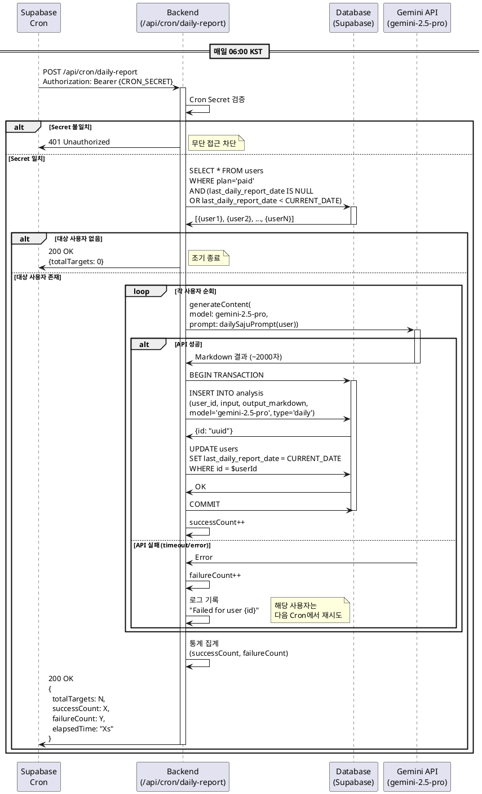

# UC-003: 일일 리포트 자동 생성 (Cron)

**Feature ID**: 011
**Version**: 1.0.0
**Date**: 2025-01-06
**Status**: Ready for Implementation

---

## Primary Actor

**시스템 (System)** - Supabase Cron Scheduler

---

## Precondition

- Supabase Cron이 활성화되어 있음
- `/api/cron/daily-report` 엔드포인트가 배포됨
- `CRON_SECRET` 환경 변수가 설정됨
- `users` 테이블에 `plan='paid'` 사용자가 1명 이상 존재
- 해당 사용자의 `birth_date`, `birth_time`, `gender` 정보가 입력되어 있음

---

## Trigger

**매일 06:00 KST (UTC+9) 자동 실행**

Supabase Cron 설정:
```sql
SELECT cron.schedule(
  'daily-saju-report-generation',
  '0 6 * * *',  -- 매일 06:00 KST (실제로는 21:00 UTC 전날)
  $$
  SELECT net.http_post(
    url := 'https://your-domain.vercel.app/api/cron/daily-report',
    headers := jsonb_build_object(
      'Content-Type', 'application/json',
      'Authorization', 'Bearer ' || current_setting('app.cron_secret')
    ),
    body := '{}'::jsonb
  );
  $$
);
```

---

## Main Scenario

### 1. Cron 트리거 실행
- Supabase Cron이 예약된 시각(06:00 KST) 도래
- `/api/cron/daily-report` POST 요청 전송
- 요청 헤더에 `Authorization: Bearer {CRON_SECRET}` 포함

### 2. Cron Secret 검증
- 백엔드가 요청 수신
- Authorization 헤더 검증:
  ```typescript
  const authHeader = req.headers.get('authorization');
  const token = authHeader?.replace('Bearer ', '');

  if (token !== process.env.CRON_SECRET) {
    return Response.json({ error: 'Unauthorized' }, { status: 401 });
  }
  ```
- 검증 실패 시 401 에러 반환 및 중단

### 3. 리포트 생성 대상 조회
- Supabase에서 리포트 생성 필요한 사용자 조회:
  ```sql
  SELECT
    id,
    email,
    name,
    birth_date,
    birth_time,
    gender,
    last_daily_report_date
  FROM users
  WHERE plan = 'paid'
    AND birth_date IS NOT NULL
    AND (
      last_daily_report_date IS NULL
      OR last_daily_report_date < CURRENT_DATE
    )
  ORDER BY last_daily_report_date ASC NULLS FIRST
  LIMIT 1000;  -- 배치 크기 제한
  ```
- 대상 사용자 수 로깅: `console.log('Daily report targets: ${users.length}')`

### 4. 각 사용자별 AI 분석 생성 (병렬 처리)
- 대상 사용자 배열을 순회하며 분석 생성
- 각 사용자에 대해:

  **4-1. Gemini Pro 모델 호출**
  ```typescript
  const result = await generateProSajuAnalysis({
    name: user.name,
    birthDate: user.birth_date,
    birthTime: user.birth_time,
    gender: user.gender
  });
  ```
  - 모델: `gemini-2.5-pro`
  - 프롬프트: 오늘 날짜 기준 일일 운세
  - Timeout: 15초

  **4-2. 분석 결과 저장**
  ```sql
  INSERT INTO analysis (
    user_id,
    input,
    output_markdown,
    model,
    type,
    created_at
  ) VALUES (
    $userId,
    $inputJson,
    $aiOutput,
    'gemini-2.5-pro',
    'daily',
    NOW()
  )
  RETURNING id;
  ```

  **4-3. 리포트 생성일 갱신**
  ```sql
  UPDATE users
  SET last_daily_report_date = CURRENT_DATE
  WHERE id = $userId;
  ```

### 5. 배치 처리 통계 집계
- 처리 결과 카운팅:
  - 성공: `successCount`
  - 실패: `failureCount`
  - 총 대상: `totalTargets`
- 처리 시간 기록: `elapsedTime`

### 6. 처리 결과 응답 및 로깅
- 응답 반환:
  ```json
  {
    "success": true,
    "totalTargets": 150,
    "successCount": 148,
    "failureCount": 2,
    "elapsedTime": "45.2s",
    "timestamp": "2025-01-06T06:00:00.000Z"
  }
  ```
- 실패한 사용자 ID 별도 로깅
- 처리 통계 메트릭 저장 (선택)

---

## Edge Cases

### EC-1: 대상 사용자 없음

**Trigger**: 3단계에서 `plan='paid'` 사용자가 0명

**처리**:
1. 조기 종료
2. 응답 반환:
   ```json
   {
     "success": true,
     "totalTargets": 0,
     "message": "No users require daily report generation"
   }
   ```
3. 정상 종료 (에러 아님)

**Expected Outcome**: Cron이 성공 상태로 완료

---

### EC-2: Gemini API 부분 실패

**Trigger**: 일부 사용자의 AI 생성이 실패 (timeout, rate limit)

**처리**:
1. 실패한 사용자는 `last_daily_report_date` 업데이트 안 함
2. 다음 Cron 실행 시 재시도 대상에 포함
3. 실패 로그 기록:
   ```typescript
   console.error('Daily report failed for user:', {
     userId: user.id,
     error: error.message
   });
   ```
4. 전체 배치는 계속 진행 (실패 1건이 전체를 막지 않음)
5. 응답에 실패 카운트 포함

**Expected Outcome**: 성공한 사용자는 리포트 받고, 실패는 다음 날 재시도

---

### EC-3: 대량 사용자 처리 (1000명 초과)

**Trigger**: 3단계에서 대상 사용자가 1000명 초과

**처리**:
1. 첫 1000명만 처리 (LIMIT 1000)
2. 나머지는 다음 Cron 실행에서 처리
3. `ORDER BY last_daily_report_date ASC`로 오래된 순 우선
4. 응답에 "Batch limit reached" 플래그 추가
5. 필요 시 Cron 주기 변경 (1일 2회) 검토

**Expected Outcome**: 배치 크기 제한으로 서버 부하 관리

---

### EC-4: 생년월일 정보 누락

**Trigger**: `birth_date IS NULL` 또는 `gender IS NULL`

**처리**:
1. 조회 쿼리에서 제외 (WHERE 조건)
2. 해당 사용자는 리포트 생성 불가
3. 대시보드에서 "생년월일 정보를 입력해주세요" 안내 표시
4. 사용자가 정보 입력 후 다음 Cron에서 자동 생성

**Expected Outcome**: 필수 정보 없는 사용자는 생성 대상에서 제외

---

### EC-5: Cron Secret 검증 실패

**Trigger**: 잘못된 Authorization 헤더 또는 Secret 불일치

**처리**:
1. 401 Unauthorized 응답
2. 에러 로그 기록:
   ```typescript
   console.error('Cron authentication failed:', {
     ip: req.ip,
     headers: req.headers
   });
   ```
3. 처리 중단 (보안 위협 가능성)

**Expected Outcome**: 무단 접근 차단

---

### EC-6: 중복 실행 방지

**Trigger**: Cron이 예기치 않게 중복 실행됨

**처리**:
1. Redis 또는 DB 기반 Distributed Lock 사용:
   ```typescript
   const lockKey = `cron:daily-report:${today}`;
   const acquired = await acquireLock(lockKey, ttl: 3600);

   if (!acquired) {
     return Response.json({
       message: 'Already running'
     }, { status: 409 });
   }
   ```
2. 처리 완료 후 Lock 해제
3. Lock TTL로 자동 만료 보장

**Expected Outcome**: 동일 날짜에 1회만 실행

---

## Business Rules

### BR-1: 대상 사용자 선정 기준
- `plan='paid'` (유료 구독자만)
- `birth_date IS NOT NULL` (생년월일 필수)
- `last_daily_report_date IS NULL` (최초 생성)
  - 또는 `last_daily_report_date < CURRENT_DATE` (갱신 필요)
- 해지 예정(`plan='cancelled'`)도 `next_billing_date`까지 생성

### BR-2: AI 모델 사용
- 모델: `gemini-2.5-pro` 고정
- 응답 평균 길이: 2000자 (상세형)
- Timeout: 15초
- Retry: 2회 (exponential backoff)

### BR-3: 실행 시간 및 주기
- 실행 시각: 매일 06:00 KST
- 이유: 사용자가 출근 전 확인하기 적절한 시간
- 주말/공휴일 구분 없이 매일 실행

### BR-4: 처리 성능 목표
- 사용자당 평균 처리 시간: < 10초
- 전체 배치 완료 시간: < 20분 (100명 기준)
- Gemini API 성공률: > 98%
- Timeout: 30분 (Vercel Serverless 제한)

### BR-5: 실패 재시도 정책
- 당일 실패 시 `last_daily_report_date` 갱신 안 함
- 다음 날 Cron에서 자동 재시도
- 3일 연속 실패 시 관리자 알림
- 7일 연속 실패 시 사용자 알림 (생년월일 재확인)

### BR-6: 데이터 저장 정책
- 모든 일일 리포트는 `analysis` 테이블에 영구 저장
- `type='daily'` 태그로 구분
- 사용자는 과거 리포트 모두 열람 가능
- 저장 용량 관리: 필요 시 90일 이전 데이터 아카이브

---

## External Service Integration

### Gemini API (gemini-2.5-pro)

**Purpose**: 유료 구독자 일일 사주 분석 생성

**Model**: `gemini-2.5-pro`

**Request**:
```typescript
import { generateProSajuAnalysis } from '@/lib/gemini';

for (const user of users) {
  try {
    const result = await generateProSajuAnalysis({
      name: user.name,
      birthDate: user.birth_date,
      birthTime: user.birth_time || '모름',
      gender: user.gender
    });

    await saveAnalysis(user.id, result);
    await updateReportDate(user.id);
    successCount++;
  } catch (error) {
    console.error(`Failed for user ${user.id}:`, error);
    failureCount++;
  }
}
```

**Rate Limit Handling**:
- Gemini API: 60 requests/minute
- 배치 처리: 초당 1-2건씩 (throttle)
- Rate limit 초과 시 exponential backoff

**Reference**: `/docs/external/gemini-integration-guide.md`

---

### Supabase Cron

**Purpose**: 매일 06:00 KST에 `/api/cron/daily-report` 트리거

**Configuration**:
```sql
-- Supabase SQL Editor에서 실행
SELECT cron.schedule(
  'daily-saju-report',
  '0 21 * * *',  -- 21:00 UTC = 06:00 KST (다음날)
  $$
  SELECT net.http_post(
    url := 'https://vcm-saju.vercel.app/api/cron/daily-report',
    headers := jsonb_build_object(
      'Content-Type', 'application/json',
      'Authorization', 'Bearer ' || current_setting('app.cron_secret')
    )
  );
  $$
);
```

**Monitoring**:
```sql
-- Cron 실행 내역 조회
SELECT * FROM cron.job_run_details
WHERE jobname = 'daily-saju-report'
ORDER BY start_time DESC
LIMIT 10;
```

---

## Database Security

### Architecture: Clerk Auth + Supabase Service Role

**Security Model**: Cron Job → Cron Secret Verification → Supabase (Service Role Key)

이 Usecase는 Clerk 사용자 인증이 아닌 **Cron Secret 검증**을 통해 보안을 유지합니다.

**Why Service Role Key?**
1. **Cron Job Context**: 사용자 세션이 없는 백그라운드 작업
2. **Batch Processing**: 다수 사용자 데이터에 접근 필요
3. **Authorization**: Cron Secret으로 시스템 권한 검증

### RLS (Row Level Security) Policies

모든 테이블은 **Service Role 전용 접근**으로 설정됩니다:

```sql
-- users 테이블: Service Role 전용 접근
CREATE POLICY "service_role_all_users"
  ON users FOR ALL
  USING (auth.role() = 'service_role');

-- analysis 테이블: Service Role 전용 접근
CREATE POLICY "service_role_all_analysis"
  ON analysis FOR ALL
  USING (auth.role() = 'service_role');
```

**Important**:
- Client에서 Supabase에 직접 접근 불가
- 모든 DB 작업은 Next.js API Routes를 경유 (Service Role Key 사용)
- Cron 엔드포인트는 `CRON_SECRET`으로 무단 접근 차단

### Cron Authorization Pattern

```typescript
// src/app/api/cron/daily-report/route.ts
import { createClient } from '@/lib/supabase/server';

export async function POST(req: Request) {
  // 1. Cron Secret 검증 (시스템 권한)
  const authHeader = req.headers.get('authorization');
  const token = authHeader?.replace('Bearer ', '');

  if (token !== process.env.CRON_SECRET) {
    return new Response('Unauthorized', { status: 401 });
  }

  // 2. Supabase Service Role Client 생성
  const supabase = await createClient();  // Service Role Key 사용

  // 3. 리포트 대상 조회 (Batch 단위)
  const { data: users, error } = await supabase
    .from('users')
    .select('id, email, name, birth_date, birth_time, gender, last_daily_report_date')
    .eq('plan', 'paid')
    .or('last_daily_report_date.is.null,last_daily_report_date.lt.today')
    .limit(1000);

  if (error) {
    console.error('Failed to fetch users:', error);
    return Response.json({ error: 'Database query failed' }, { status: 500 });
  }

  // 4. 각 사용자별 분석 생성 및 저장
  for (const user of users) {
    try {
      // AI 분석 생성
      const analysis = await generateProSajuAnalysis({
        name: user.name,
        birthDate: user.birth_date,
        birthTime: user.birth_time,
        gender: user.gender
      });

      // Supabase에 저장 (Service Role로 INSERT)
      await supabase.from('analysis').insert({
        user_id: user.id,
        input: JSON.stringify({
          name: user.name,
          birthDate: user.birth_date,
          type: 'daily'
        }),
        output_markdown: analysis,
        model: 'gemini-2.5-pro',
        type: 'daily'
      });

      // 리포트 생성일 갱신
      await supabase.from('users')
        .update({ last_daily_report_date: new Date().toISOString().split('T')[0] })
        .eq('id', user.id);

    } catch (error) {
      console.error(`Failed for user ${user.id}:`, error);
      // 실패 시 continue (다음 사용자 처리)
    }
  }

  return Response.json({ success: true });
}
```

**Security Checklist**:
- ✅ Cron Secret 검증으로 무단 호출 차단
- ✅ Service Role Key로 배치 데이터 접근
- ✅ RLS 정책으로 Client 직접 접근 불가
- ✅ 실패 로그에 민감 정보 제외 (사용자 ID만)

**Reference**: `/docs/database.md` (RLS Policies 섹션)

---

## Sequence Diagram



---

## Success Criteria

### 기능 완료 조건
- [ ] Supabase Cron이 매일 06:00 KST에 자동 실행
- [ ] 유료 구독자 전원에게 일일 리포트 생성
- [ ] 생성된 리포트가 `analysis` 테이블에 저장
- [ ] `last_daily_report_date`가 정상 갱신
- [ ] 실패 시 다음 날 자동 재시도

### 성능 목표
- [ ] 사용자당 평균 처리 시간 < 10초
- [ ] Gemini API 성공률 > 98%
- [ ] 100명 배치 완료 시간 < 20분
- [ ] Rate limit 초과 없이 안정적 처리

### 운영 목표
- [ ] Cron 실행 내역 모니터링 가능
- [ ] 실패 사용자 로그 기록
- [ ] 3일 연속 실패 시 알림 발송

---

## Monitoring & Alerts

### 모니터링 메트릭
```sql
-- 최근 7일간 Cron 실행 통계
SELECT
  DATE(start_time) as date,
  COUNT(*) as total_runs,
  SUM(CASE WHEN status = 'succeeded' THEN 1 ELSE 0 END) as success_runs,
  AVG(EXTRACT(EPOCH FROM (end_time - start_time))) as avg_duration_sec
FROM cron.job_run_details
WHERE jobname = 'daily-saju-report'
  AND start_time > NOW() - INTERVAL '7 days'
GROUP BY DATE(start_time)
ORDER BY date DESC;
```

### 알림 조건
1. **실패 알림**: 3일 연속 실패 사용자
2. **성능 알림**: 처리 시간 30분 초과
3. **Rate Limit 알림**: Gemini API 429 에러 발생
4. **Cron 미실행 알림**: 예정 시각 +1시간 지나도 실행 안 됨

---

## References

- Feature Specification: `/docs/userflow.md` (Feature 011)
- Database Schema: `/docs/database.md` (users, analysis)
- AI Prompt Template: `/docs/prompt/daily-saju.md`
- Gemini Integration: `/docs/external/gemini-integration-guide.md`
- Implementation: `src/app/api/cron/daily-report/route.ts`
