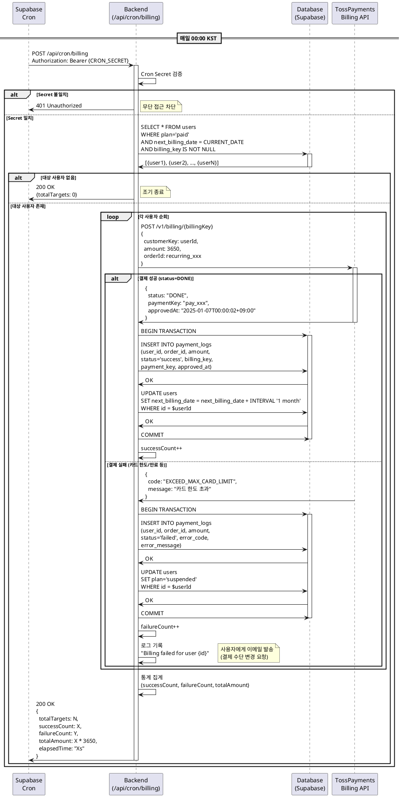

# UC-004: 정기결제 자동화 (Recurring Billing)

**Feature ID**: 012
**Version**: 1.0.0
**Date**: 2025-01-07
**Status**: Ready for Implementation

---

## Primary Actor

**시스템 (System)** - Supabase Cron Scheduler

---

## Precondition

- Supabase Cron이 활성화되어 있음
- `/api/cron/billing` 엔드포인트가 배포됨
- `CRON_SECRET` 환경 변수가 설정됨
- TossPayments API 연동 완료 (`TOSS_SECRET_KEY` 설정)
- `users` 테이블에 `plan='paid'` 사용자가 1명 이상 존재
- 해당 사용자의 `billing_key`가 존재하고 `next_billing_date`가 설정되어 있음

---

## Trigger

**매일 00:00 KST (UTC+9) 자동 실행**

Supabase Cron 설정:
```sql
SELECT cron.schedule(
  'recurring-billing-automation',
  '0 15 * * *',  -- 매일 15:00 UTC = 00:00 KST (다음날)
  $$
  SELECT net.http_post(
    url := 'https://your-domain.vercel.app/api/cron/billing',
    headers := jsonb_build_object(
      'Content-Type', 'application/json',
      'Authorization', 'Bearer ' || current_setting('app.cron_secret')
    ),
    body := '{}'::jsonb
  );
  $$
);
```

---

## Main Scenario

### 1. Cron 트리거 실행
- Supabase Cron이 예약된 시각(00:00 KST) 도래
- `/api/cron/billing` POST 요청 전송
- 요청 헤더에 `Authorization: Bearer {CRON_SECRET}` 포함

### 2. Cron Secret 검증
- 백엔드가 요청 수신
- Authorization 헤더 검증:
  ```typescript
  const authHeader = req.headers.get('authorization');
  const token = authHeader?.replace('Bearer ', '');

  if (token !== process.env.CRON_SECRET) {
    return Response.json({ error: 'Unauthorized' }, { status: 401 });
  }
  ```
- 검증 실패 시 401 에러 반환 및 중단

### 3. 결제 대상 사용자 조회
- Supabase에서 오늘 결제 예정인 사용자 조회:
  ```sql
  SELECT
    id,
    email,
    name,
    billing_key,
    next_billing_date,
    plan
  FROM users
  WHERE plan = 'paid'
    AND next_billing_date = CURRENT_DATE
    AND billing_key IS NOT NULL
  ORDER BY next_billing_date ASC
  LIMIT 500;  -- 배치 크기 제한
  ```
- 대상 사용자 수 로깅: `console.log('Billing targets: ${users.length}')`

### 4. 각 사용자별 자동 청구 실행

- 대상 사용자 배열을 순회하며 결제 처리
- 각 사용자에 대해:

  **4-1. TossPayments Billing Key API 호출**
  ```typescript
  const orderId = `recurring_${userId}_${Date.now()}`;

  const response = await fetch('https://api.tosspayments.com/v1/billing/{billingKey}', {
    method: 'POST',
    headers: {
      Authorization: `Basic ${Buffer.from(TOSS_SECRET_KEY + ':').toString('base64')}`,
      'Content-Type': 'application/json'
    },
    body: JSON.stringify({
      customerKey: userId,
      amount: 3650,
      orderId: orderId,
      orderName: '365일 사주 월간 구독',
      customerEmail: user.email,
      customerName: user.name
    })
  });
  ```

  **4-2. 결제 성공 처리**
  - TossPayments API 응답 `status: 'DONE'` 확인
  - `payment_logs` 테이블에 성공 기록:
    ```sql
    INSERT INTO payment_logs (
      user_id,
      order_id,
      amount,
      status,
      billing_key,
      payment_key,
      approved_at,
      created_at
    ) VALUES (
      $userId,
      $orderId,
      3650,
      'success',
      $billingKey,
      $paymentKey,
      NOW(),
      NOW()
    );
    ```

  - `users` 테이블 갱신 (다음 결제일 +1개월):
    ```sql
    UPDATE users
    SET next_billing_date = next_billing_date + INTERVAL '1 month'
    WHERE id = $userId;
    ```

  **4-3. 결제 실패 처리**
  - TossPayments API 에러 응답 수신
  - `payment_logs` 테이블에 실패 기록:
    ```sql
    INSERT INTO payment_logs (
      user_id,
      order_id,
      amount,
      status,
      billing_key,
      error_code,
      error_message,
      created_at
    ) VALUES (
      $userId,
      $orderId,
      3650,
      'failed',
      $billingKey,
      $errorCode,
      $errorMessage,
      NOW()
    );
    ```

  - `users` 테이블 플랜 상태 변경:
    ```sql
    UPDATE users
    SET plan = 'suspended'
    WHERE id = $userId;
    ```

  - 사용자 알림 큐에 추가 (이메일 발송 예정)

### 5. 배치 처리 통계 집계
- 처리 결과 카운팅:
  - 성공: `successCount`
  - 실패: `failureCount`
  - 총 대상: `totalTargets`
- 처리 시간 기록: `elapsedTime`
- 총 결제 금액: `totalAmount = successCount * 3650`

### 6. 처리 결과 응답 및 로깅
- 응답 반환:
  ```json
  {
    "success": true,
    "totalTargets": 50,
    "successCount": 48,
    "failureCount": 2,
    "totalAmount": 175200,
    "elapsedTime": "12.5s",
    "timestamp": "2025-01-07T00:00:00.000Z"
  }
  ```
- 실패한 사용자 ID 및 에러 코드 별도 로깅
- 처리 통계 메트릭 저장 (선택)

---

## Edge Cases

### EC-1: 대상 사용자 없음

**Trigger**: 3단계에서 결제 예정 사용자가 0명

**처리**:
1. 조기 종료
2. 응답 반환:
   ```json
   {
     "success": true,
     "totalTargets": 0,
     "message": "No billing targets for today"
   }
   ```
3. 정상 종료 (에러 아님)

**Expected Outcome**: Cron이 성공 상태로 완료

---

### EC-2: TossPayments API 부분 실패

**Trigger**: 일부 사용자의 결제가 실패 (카드 한도 초과, 유효기간 만료 등)

**처리**:
1. 실패한 사용자는 `plan='suspended'`로 변경
2. `payment_logs`에 실패 내역 기록 (error_code, error_message 포함)
3. 전체 배치는 계속 진행 (실패 1건이 전체를 막지 않음)
4. 실패 로그 기록:
   ```typescript
   console.error('Billing failed for user:', {
     userId: user.id,
     email: user.email,
     errorCode: error.code,
     errorMessage: error.message
   });
   ```
5. 사용자 알림 발송 큐에 추가
6. 응답에 실패 카운트 포함

**Expected Outcome**:
- 성공한 사용자는 정상 결제 완료
- 실패한 사용자는 서비스 일시 중단, 이메일로 결제 수단 변경 안내

---

### EC-3: Billing Key 만료 또는 삭제

**Trigger**: `billing_key`가 TossPayments에 존재하지 않음 (사용자가 카드 삭제)

**처리**:
1. TossPayments API 에러 응답: `NOT_FOUND_BILLING_KEY`
2. `payment_logs`에 실패 기록
3. `users` 테이블 갱신:
   ```sql
   UPDATE users
   SET plan = 'suspended',
       billing_key = NULL
   WHERE id = $userId;
   ```
4. 사용자에게 이메일 발송: "결제 수단이 삭제되었습니다. 재등록 필요"
5. 다음 Cron에서 대상에서 제외 (`billing_key IS NOT NULL` 조건)

**Expected Outcome**: 사용자는 구독 페이지에서 결제 수단 재등록 필요

---

### EC-4: TossPayments API 전체 장애

**Trigger**: TossPayments API가 응답하지 않거나 500 에러

**처리**:
1. Fetch timeout 설정 (10초)
2. Retry 로직 적용:
   - 최대 3회 재시도
   - Exponential backoff (2초, 4초, 8초)
3. 3회 실패 시:
   - 해당 사용자는 재시도 큐에 추가
   - `payment_logs`에 `status='pending'` 기록
   - 관리자 알림 전송
4. 다음 Cron 실행 시 `pending` 상태 건 우선 처리

**Expected Outcome**:
- API 장애 시에도 데이터 손실 없음
- 복구 후 자동 재처리

---

### EC-5: Cron Secret 검증 실패

**Trigger**: 잘못된 Authorization 헤더 또는 Secret 불일치

**처리**:
1. 401 Unauthorized 응답
2. 에러 로그 기록:
   ```typescript
   console.error('Cron authentication failed:', {
     ip: req.ip,
     headers: req.headers,
     timestamp: new Date().toISOString()
   });
   ```
3. 처리 중단 (보안 위협 가능성)

**Expected Outcome**: 무단 접근 차단

---

### EC-6: 중복 실행 방지

**Trigger**: Cron이 예기치 않게 중복 실행됨

**처리**:
1. Redis 또는 DB 기반 Distributed Lock 사용:
   ```typescript
   const lockKey = `cron:billing:${today}`;
   const acquired = await acquireLock(lockKey, { ttl: 3600 });

   if (!acquired) {
     return Response.json({
       message: 'Billing job already running for today'
     }, { status: 409 });
   }
   ```
2. 처리 완료 후 Lock 해제
3. Lock TTL로 자동 만료 보장 (1시간)

**Expected Outcome**: 동일 날짜에 1회만 실행, 중복 청구 방지

---

## Business Rules

### BR-1: 결제 대상 선정 기준
- `plan='paid'` (유료 구독 활성 상태)
- `next_billing_date = CURRENT_DATE` (오늘이 결제일)
- `billing_key IS NOT NULL` (결제 수단 등록됨)
- 해지 예정(`plan='cancelled'`)은 제외 (next_billing_date까지만 유효)

### BR-2: 결제 금액 및 정책
- 월 구독료: ₩3,650 고정
- 부가세 포함 금액
- 환불 정책: 당일 결제 취소 가능 (사용자 요청 시)
- 프로모션 코드: 향후 확장 고려

### BR-3: 실행 시간 및 주기
- 실행 시각: 매일 00:00 KST
- 이유: 사용자가 새벽에 결제되어 아침에 확인 가능
- 주말/공휴일 구분 없이 매일 실행
- Cron 실행 시간대: 15:00 UTC (00:00 KST)

### BR-4: TossPayments API 요청 규격
- Endpoint: `POST /v1/billing/{billingKey}`
- Authentication: Basic Auth (TOSS_SECRET_KEY)
- Timeout: 10초
- Retry: 최대 3회 (exponential backoff)
- Rate Limit: 초당 10건 (필요 시 throttling)

### BR-5: 결제 실패 후속 조치
- 즉시 처리:
  - `plan='suspended'` 변경
  - 일일 리포트 생성 중단
  - 대시보드에 결제 실패 배너 표시
- 이메일 알림 발송 (24시간 이내)
  - 제목: "[365일 사주] 결제 실패 안내"
  - 내용: 결제 수단 변경 링크 제공
- 7일 이내 미복구 시 `plan='free'`로 전환 (별도 Cron)

### BR-6: 배치 처리 성능 목표
- 사용자당 평균 처리 시간: < 5초
- 전체 배치 완료 시간: < 5분 (50명 기준)
- TossPayments API 성공률: > 98%
- Timeout: 10분 (Vercel Serverless 제한)

### BR-7: 데이터 보관 정책
- 모든 결제 내역은 `payment_logs`에 영구 저장
- 성공/실패 모두 기록 (감사 로그)
- 개인정보 보호: `payment_logs`에 카드 번호 미저장
- 로그 조회 권한: 관리자 및 해당 사용자만

---

## External Service Integration

### TossPayments Billing Key API

**Purpose**: 저장된 billing_key로 자동 청구 실행

**Endpoint**: `POST https://api.tosspayments.com/v1/billing/{billingKey}`

**Authentication**:
```typescript
const authHeader = 'Basic ' + Buffer.from(TOSS_SECRET_KEY + ':').toString('base64');
```

**Request Body**:
```json
{
  "customerKey": "user_clerk_id",
  "amount": 3650,
  "orderId": "recurring_user123_1704585600000",
  "orderName": "365일 사주 월간 구독",
  "customerEmail": "user@example.com",
  "customerName": "홍길동"
}
```

**Success Response (200)**:
```json
{
  "mId": "tosspayments",
  "transactionKey": "6C0DC15C1D77D09CC432A02C2B3989B7",
  "paymentKey": "pay_gY3KpY03qnLovE6Wo9NP2",
  "orderId": "recurring_user123_1704585600000",
  "orderName": "365일 사주 월간 구독",
  "taxExemptionAmount": 0,
  "status": "DONE",
  "requestedAt": "2025-01-07T00:00:01+09:00",
  "approvedAt": "2025-01-07T00:00:02+09:00",
  "totalAmount": 3650,
  "balanceAmount": 3650,
  "suppliedAmount": 3318,
  "vat": 332,
  "method": "카드",
  "card": {
    "company": "신한",
    "number": "1234********5678",
    "installmentPlanMonths": 0
  }
}
```

**Error Response (4xx/5xx)**:
```json
{
  "code": "NOT_FOUND_BILLING_KEY",
  "message": "존재하지 않는 빌링키입니다."
}
```

**Common Error Codes**:
- `NOT_FOUND_BILLING_KEY`: billing_key 미존재 → plan='suspended', billing_key=NULL
- `EXCEED_MAX_CARD_LIMIT`: 카드 한도 초과 → 사용자 알림
- `INVALID_CARD_EXPIRATION`: 카드 유효기간 만료 → 결제 수단 재등록 요청
- `PROVIDER_ERROR`: PG사 오류 → Retry 3회

**Rate Limiting**:
- TossPayments API: 초당 10건
- 배치 처리 시 throttling 적용 (100ms 간격)

**Reference**: `/docs/external/tosspayments-webhook-guide.md`

---

### Supabase Cron

**Purpose**: 매일 00:00 KST에 `/api/cron/billing` 트리거

**Configuration**:
```sql
-- Supabase SQL Editor에서 실행
SELECT cron.schedule(
  'recurring-billing',
  '0 15 * * *',  -- 15:00 UTC = 00:00 KST (다음날)
  $$
  SELECT net.http_post(
    url := 'https://vcm-saju.vercel.app/api/cron/billing',
    headers := jsonb_build_object(
      'Content-Type', 'application/json',
      'Authorization', 'Bearer ' || current_setting('app.cron_secret')
    )
  );
  $$
);
```

**Monitoring**:
```sql
-- Cron 실행 내역 조회
SELECT * FROM cron.job_run_details
WHERE jobname = 'recurring-billing'
ORDER BY start_time DESC
LIMIT 10;
```

---

## Database Security

### Architecture: Clerk Auth + Supabase Service Role

**Security Model**: Cron Job → Cron Secret Verification → Supabase (Service Role Key)

이 Usecase는 Clerk 사용자 인증이 아닌 **Cron Secret 검증**을 통해 보안을 유지합니다.

**Why Service Role Key?**
1. **Cron Job Context**: 사용자 세션이 없는 백그라운드 작업
2. **Batch Processing**: 다수 사용자 데이터 및 결제 정보 접근 필요
3. **Authorization**: Cron Secret으로 시스템 권한 검증
4. **PII Protection**: 결제 정보는 Service Role로만 접근 가능

### RLS (Row Level Security) Policies

모든 테이블은 **Service Role 전용 접근**으로 설정됩니다:

```sql
-- users 테이블: Service Role 전용 접근
CREATE POLICY "service_role_all_users"
  ON users FOR ALL
  USING (auth.role() = 'service_role');

-- payment_logs 테이블: Service Role 전용 접근
CREATE POLICY "service_role_all_payment_logs"
  ON payment_logs FOR ALL
  USING (auth.role() = 'service_role');
```

**Important**:
- Client에서 Supabase에 직접 접근 불가
- 모든 DB 작업은 Next.js API Routes를 경유 (Service Role Key 사용)
- Cron 엔드포인트는 `CRON_SECRET`으로 무단 접근 차단
- 결제 정보(`billing_key`, `payment_logs`)는 절대 Client에 노출 금지

### Cron + TossPayments Authorization Pattern

```typescript
// src/app/api/cron/billing/route.ts
import { createClient } from '@/lib/supabase/server';

export async function POST(req: Request) {
  // 1. Cron Secret 검증 (시스템 권한)
  const authHeader = req.headers.get('authorization');
  const token = authHeader?.replace('Bearer ', '');

  if (token !== process.env.CRON_SECRET) {
    return new Response('Unauthorized', { status: 401 });
  }

  // 2. Supabase Service Role Client 생성
  const supabase = await createClient();  // Service Role Key 사용

  // 3. 결제 대상 조회 (Batch 단위)
  const { data: users, error } = await supabase
    .from('users')
    .select('id, email, name, billing_key, next_billing_date')
    .eq('plan', 'paid')
    .eq('next_billing_date', new Date().toISOString().split('T')[0])
    .not('billing_key', 'is', null)
    .limit(500);

  if (error) {
    console.error('Failed to fetch billing targets:', error);
    return Response.json({ error: 'Database query failed' }, { status: 500 });
  }

  // 4. 각 사용자별 TossPayments 자동 청구
  let successCount = 0;
  let failureCount = 0;

  for (const user of users) {
    const orderId = `recurring_${user.id}_${Date.now()}`;

    try {
      // TossPayments Billing Key API 호출
      const tossResponse = await fetch(
        `https://api.tosspayments.com/v1/billing/${user.billing_key}`,
        {
          method: 'POST',
          headers: {
            'Authorization': `Basic ${Buffer.from(process.env.TOSS_SECRET_KEY + ':').toString('base64')}`,
            'Content-Type': 'application/json'
          },
          body: JSON.stringify({
            customerKey: user.id,
            amount: 3650,
            orderId: orderId,
            orderName: '365일 사주 월간 구독',
            customerEmail: user.email,
            customerName: user.name
          })
        }
      );

      const payment = await tossResponse.json();

      if (payment.status === 'DONE') {
        // 결제 성공: payment_logs 기록 + next_billing_date 갱신
        await supabase.from('payment_logs').insert({
          user_id: user.id,
          order_id: orderId,
          amount: 3650,
          status: 'success',
          billing_key: user.billing_key,
          payment_key: payment.paymentKey,
          approved_at: payment.approvedAt
        });

        await supabase.from('users')
          .update({
            next_billing_date: new Date(Date.now() + 30 * 24 * 60 * 60 * 1000)
              .toISOString()
              .split('T')[0]
          })
          .eq('id', user.id);

        successCount++;
      } else {
        throw new Error('Payment not completed');
      }

    } catch (error: any) {
      // 결제 실패: payment_logs 기록 + plan='suspended'
      console.error(`Billing failed for user ${user.id}:`, error);

      await supabase.from('payment_logs').insert({
        user_id: user.id,
        order_id: orderId,
        amount: 3650,
        status: 'failed',
        billing_key: user.billing_key,
        error_code: error.code || 'UNKNOWN_ERROR',
        error_message: error.message
      });

      await supabase.from('users')
        .update({ plan: 'suspended' })
        .eq('id', user.id);

      failureCount++;
    }
  }

  return Response.json({
    success: true,
    totalTargets: users.length,
    successCount,
    failureCount
  });
}
```

**Security Checklist**:
- ✅ Cron Secret 검증으로 무단 호출 차단
- ✅ Service Role Key로 배치 데이터 및 결제 정보 접근
- ✅ RLS 정책으로 Client 직접 접근 불가
- ✅ TossPayments API Secret Key는 서버 전용
- ✅ 실패 로그에 민감 정보 제외 (사용자 ID, 에러 코드만)
- ✅ `billing_key`, `payment_logs`는 절대 Client 노출 금지

**Reference**: `/docs/database.md` (RLS Policies 섹션)

---

## Sequence Diagram



---

## Success Criteria

### 기능 완료 조건
- [ ] Supabase Cron이 매일 00:00 KST에 자동 실행
- [ ] 결제 예정일(`next_billing_date`)이 오늘인 사용자 자동 청구
- [ ] 결제 성공 시 `next_billing_date` +1개월 갱신
- [ ] 결제 실패 시 `plan='suspended'` 변경 및 사용자 알림
- [ ] 모든 결제 내역이 `payment_logs`에 기록
- [ ] TossPayments Webhook과 Cron 백업 체계 병행 운영

### 성능 목표
- [ ] 사용자당 평균 처리 시간 < 5초
- [ ] TossPayments API 성공률 > 98%
- [ ] 50명 배치 완료 시간 < 5분
- [ ] Rate limit 초과 없이 안정적 처리

### 운영 목표
- [ ] Cron 실행 내역 모니터링 가능
- [ ] 결제 실패 사용자 자동 알림 발송
- [ ] 3일 연속 실패 시 관리자 알림
- [ ] 결제 성공률 99% 이상 유지

---

## Monitoring & Alerts

### 모니터링 메트릭
```sql
-- 최근 7일간 Cron 실행 통계
SELECT
  DATE(start_time) as date,
  COUNT(*) as total_runs,
  SUM(CASE WHEN status = 'succeeded' THEN 1 ELSE 0 END) as success_runs,
  AVG(EXTRACT(EPOCH FROM (end_time - start_time))) as avg_duration_sec
FROM cron.job_run_details
WHERE jobname = 'recurring-billing'
  AND start_time > NOW() - INTERVAL '7 days'
GROUP BY DATE(start_time)
ORDER BY date DESC;

-- 오늘 결제 통계
SELECT
  status,
  COUNT(*) as count,
  SUM(amount) as total_amount
FROM payment_logs
WHERE DATE(created_at) = CURRENT_DATE
  AND order_id LIKE 'recurring_%'
GROUP BY status;

-- 결제 실패 사용자 목록
SELECT
  u.id,
  u.email,
  pl.error_code,
  pl.error_message,
  pl.created_at
FROM payment_logs pl
JOIN users u ON pl.user_id = u.id
WHERE pl.status = 'failed'
  AND DATE(pl.created_at) = CURRENT_DATE
ORDER BY pl.created_at DESC;
```

### 알림 조건
1. **실패 알림**: 결제 실패율 > 5%
2. **성능 알림**: 처리 시간 10분 초과
3. **TossPayments 장애 알림**: API 에러율 > 10%
4. **Cron 미실행 알림**: 예정 시각 +1시간 지나도 실행 안 됨

---

## References

- Feature Specification: `/docs/userflow.md` (Feature 012)
- Database Schema: `/docs/database.md` (users, payment_logs)
- TossPayments Integration: `/docs/external/tosspayments-webhook-guide.md`
- PRD User Story: `/docs/prd.md` (US-008)
- Implementation: `src/app/api/cron/billing/route.ts`